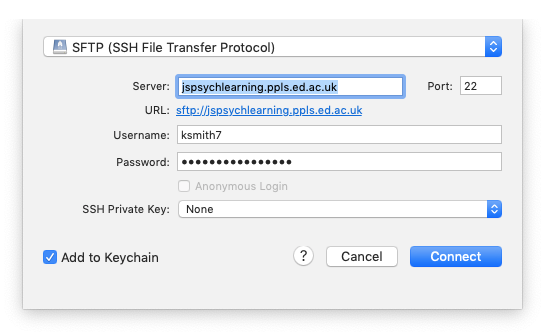

## The plan for week 1 practical

For the practical component of weeks 1 and 2 the plan is to introduce enough of the basics of jsPsych and javascript so we can jump in to building simple experiments in week 3. In week 1 we'll focus on the very basics of webpages and jsPsych, get you set up on our teaching server, and show you how to upload code there. Remember, the idea is that you can work through these practicals in the lab classes and, if necessary, in your own time - I recommend you use the lab classes as dedicated time to focus on the practicals, with on-tap support from the teaching team. 

## Practical tasks for this week

- Work through sections 01, 02 and 03 of [Online Experiments with jsPsych tutorial](https://softdev.ppls.ed.ac.uk/online_experiments/index.html).

Once you have done these tasks you should be able to access the teaching server, upload code, edit code in something like Visual Studio Code, and have a (very basic) idea of what a trivial jsPsych "hello world" experiment looks like. Next week we'll look at some more basic jsPsych stuff and also give you some basic javascript tools that we'll be using in weeks 3 onwards when we start looking at actual experiments written in jsPsych.

Some things to note as you work through the practical.

- We will be playing with code on the teaching server, `jspsychlearning.ppls.ed.ac.uk`. As soon as we have the class registration list we will create an account for you on there. Until we set that up, you won't be able to access it, but you can still read through the tutorial. 
- No need to read Section 00, the info it includes will be covered elsewhere on this course at the appropriate time!
- In section 01, the tutorial recommends using Mozilla Firefox. I actually recommend using Chrome, it's widely used by participants on crowdsourcing experiments and happens to be what I use.
- In section 02, the tutorial recommends using CyberDuck for uploading files to the server - I agree, it's very nice. Just to emphasise, *you don't need to pay for it*, although it will ask you if you'd like to occasionally. I have bought a license because I use it a lot, if that helps assuage your guilt.
- There are two ways you can use Cyberduck. You can either download files to your local computer, edit them, and re-upload them. This is quite laborious, because every time you make a change you have to re-upload the file. Cyberduck also offers a very nice option to edit the file directly (right-click the file in Cyberduck and select "Edit with..." and then select an editor, below I recommend Visual Studio Code). This is much more convenient, but sometimes the version you are editing becomes decoupled from the version on the server - so you are editing the file but those changes are not saved to the server. Watch out for this, because it's very confusing - if you are changing the experiment but the version on the server seems not to change, this might be why! See the note below on common problems.
- In section 02 the tutorial directs you to a little "hello world" demo on the jsPsych website, and Section 03 runs through some potential editors you can use to view/edit code. I am using Visual Studio Code on a Mac (which happens to be the one recommended in the jsPsych "hello world" tutorial), it's OK - if you want to use that you might have to download it from [the Visual Studio Code website](https://code.visualstudio.com).
- When downloading a copy of jsPsych, make sure you get 6.3.something - I am writing the code using 6.3.1, much earlier (or later!) versions might not be compatible. If you download from the [jsPsych GitHub release page](https://github.com/jspsych/jsPsych/releases) you are looking for a link called something like jspsych-6.3.1.zip. 
- Note that in the jsPsych "hello world" tutorial, the name of the directory they give for the jspsych code might not match the name of the directory for you. In the tutorial it says that you load the various bits of jsPsych code with code like ``, but for me the downloaded jspsych code is actually in a directory called `jspsych-6.3.1` (it's a slightly later version) so I had to edit that script call to read ``, just so the browser is looking in the right place. If you try to run the hello world tutorial code and get a blank screen and a bunch of errors in the console telling you that it can't find certain files, this might be the problem.

## Solutions to common problems

See below for some solutions to recurring problems. Remember, if you need help getting any of this stuff to work, that's what the labs are for!

### I just get a blank screen

A classic problem is that you try to run your code and just get a blank screen. That means something has gone wrong, but what? The way to start to find out is to open the javascript console and see what it says. Often it will have a line in red saying that it can't find one or more files, you fix that (e.g. making sure the files are in the right place) and that fixes it. Or it will mention a syntax error in one of the files, you fix that, and bingo.

Accessing the javascript console will be essential for finding bugs in your code - this might involve enabling developer tools for your browser, hopefully if you google "how to access javascript console in X" and "how to enable developer tools in X" where X is your browser, you'll find comprehensible instructions.

### Problem connecting to the jspsychlearning server

Check that:
1. We set up an account for you!
2. You are selecting SFTP in the cyberduck dropdown menu - i.e. for me it looks like the picture below. If you get the error "Connection failed. Connection timed out:connect. The connection attempt was rejected. The server may be down or your network may not be properly configured" this is probably the problem.

### Where do I put my Hello World code on the server?

For the hello world demo, you can just run the code on your own computer - but if you want to test it on the server, you need to copy your code into your public_html folder on jspsychlearning server. You want a folder called e.g. "hello_world" which contains experiment.html and the jspsych folder, e.g. something like this:

### How do I run the Hello World code once it's on the server?

Once you have put your code on the jspsychlearning server, you might be a bit puzzled about how to open it, and have tried e.g. clicking on the experiment.html file in cyberduck. All that will do is try to download the file back to your computer - cyberduck is for moving files about. The way to access your experiment once it's on the server is to open a web browser, e.g. chrome, and put something like http://jspsychlearning.ppls.ed.ac.uk/~UUN/hello_world/experiment.html in the address bar, where UUN is your student number (s21...). Note that this assumes your code is in your public_html folder, in a folder called hello_world - if you are using different directory names on the server, your url might be a little different. Also note the tilde (~) in front of your UUN.

### I change the code but nothing changes!

You edit your code, re-load the experiment in your browser by clicking the "reload" button, and ... nothing changes. You reload again, and still nothing. Are you losing your mind, or is your computer being willfully disobedient?

There are two reasons this might be happening, neither are due to you losing your mind. One possibility is that your browser is running a *cached* (stored) version of the code. Browsers are designed to be efficient in what they download over the internet, in order to reduce unnecessary traffic, so often when you click the "reload" button your browser will just re-run the html/javascript code it already downloaded, rather than going back to source, downloading the latest version, and running that. That's very clever unless the source code has changed, in which case it can be quite frustrating! The solution is to force your browser to re-download the code - on Chrome this is done by hitting Command-Shift-R on a Mac, or Control-Shift-R on Windows.

The other possibility is that you are not actually editing the file that you are viewing in the browser. Maybe you have two versions of the experiment in different folders say, you are editing version 1 but loading version 2 in the browser? This can also happen quite easily if you are using the "Edit with..." option on cyberduck. Behind the scenes, cyberduck makes a local version of the file, you edit that, then when you save your changes it uploads the file to the server for you (which should generate a little pop-up window telling you the new version was uploaded). This is very convenient, but sometimes the version you are editing becomes decoupled from the version on the server - so you are editing the file but those changes are not saved to the server, so you get this confusing behaviour where your changes don't change anything. The thing to watch out for is the pop-up message you get when you successfully save the file - if that stops popping up, you know your edits are not uploading to the server correclty and you are going to have problems.

### I add a file to the jspsychlearning server but it never shows up

Sometimes you need to click the "refresh" button in the top bar on the cyberduck window to see the current files on the server - it doesn't always update automatically. 

## Re-use

All aspects of this work are licensed under a [Creative Commons Attribution 4.0 International License](http://creativecommons.org/licenses/by/4.0/).
