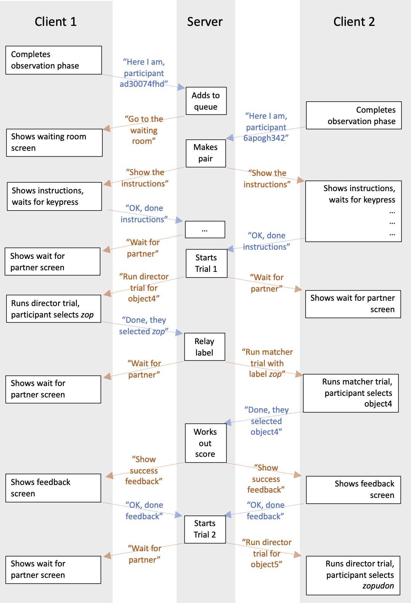

## The plan for week 10 practical

This week we are going to look at code for a dyadic interaction task based on the Combined condition of the experiment described in Kanwal et al. (2017). There's no new material to look at in the Online Experiments with jsPsych tutorial.

In terms of the trial types we need to present to participants, this experiment is actually very simple, and uses elements of the code we developed in the practicals on word learning, perceptual learning, and iterated learning.
- Participants go through an initial observation phase where they are exposed to two objects paired with short and long labels. This is basically identical to the observation phase of the word learning experiment in `word_learning.js`.
- When communicating with their partner, participants sometimes act as what I'll call the *director* - they are presented with an object and asked to select one of two labels to send to their partner. This is very similar to the production trial phase in the word learning experiment. The only difference is that we need to add a manipulation of production effort, making the longer labels more onerous to send. I explain how we do that below, but it involves a looping trial like we used in the production trials in the iterated learning code.
- When communicating with their partner, participants sometimes act as the *matcher* - they are presented with a label and asked to select one of two objects which they think their partner is labelling. This is very similar to the picture selection trials in the perceptual learning experiment, except that we are just using a text label rather than an audio file.

However, there is one substantial complication: rather than participants completing this experiment individually, they play in pairs, sending messages back and forth with their partner. We therefore need some infrastructure to allow two participants, working on web browsers anywhere in the world, to interact via the restricted communication channel we provide. The code for this isn't actually too complicated - I figured it out! - but as per last week, I am going to hide most of the detail from you; the code is available and commented if you want to look at it or edit it, but you don't have to (apart from to carry out a couple of very simple edits detailed below). Instead I'll try to explain to you how it works, at a conceptual level, and you can take the details on trust until you need to build a similar experiment yourself.

Remember, as usual the idea is that you can work through these practicals in the lab classes and, if necessary, in your own time - I recommend you use the lab classes as dedicated time to focus on the practicals, with on-tap support from the teaching team.

## A dyadic interaction experiment

### Getting started

You need a bunch of files for this experiment - an html file, a few js files, some images, and then a folder containing some python code (this is where most of the magic happens). Download the following zip file and then uncompress it where you usually do:
- <a href="code/dyadic_interaction.zip" download> Download dyadic_interaction.zip</a>

This code should actually run OK on your local computer, but it won't save your data if you run it locally - so to get the full experience, upload the whole `dyadic_interaction` folder to your `public_html` folder on the jspsychlearning server, alongside your various other experiment folders.

Once you have done that you can open the experiment in the usual way in your browser. But this time, rather than running it in one window, you will need to open the same code in *two* browser windows (both on your computer is fine, or you can play with a friend if you are running it on the server) - it's a dyadic game, it needs two players!

First, get the code and run through it so you can see what it does. Then read on. For this week I am going to focus on the conceptual level of how the dyadic interaction happens, and avoid stepping through the javascript in too much detail - like I said, most of it is re-used from earlier experiments anyway.


### Clients and servers for dyadic interaction

You are already with the notion of a server that hands communicates with some clients, because that's how code you have put on the jspsychlearning server works - a client (your web browser) contacts the server and says, e.g., "hey, give me what you have at ~ksmith7/public_html/online_experiments_practicals/word_learning/word_learning.html" and the server sends says "sure, here's the contents of that file" and sends back the html file; the client then says "hmm, looks like a need some javascript files too please" and the server sends those over too, then based on what's in the html and javascript files your browser shows stuff on the screen, collects button clicks etc. All the mechanics of how this works is hidden from us, but the basic infrastructure is information flowing between your browser and the server - they send messages back and forth, and act on the messages they receive.

We can use exactly the same sort of information flow to build a dyadic interaction experiment: we'll have some code sitting on a machine somewhere that receives requests from clients and sends information back to them; the clients then process that information and send further messages to the server. The code on the server handles the logic of how the dyadic communication game works - it keeps track of which clients (participants' web browsers) are connected, pairs them up into dyads, tells them who should be director and who should be matcher, and so on. Then the code running on the clients handles the participant side of things - what the participants see, what options they have to click on - and sends their responses back to the server.

Our clients are written in javascript and jsPsych - they show stimuli, present buttons etc, just like in all the experiments we have looked at so far, the only difference being that the server tells them what kind of trial to run, and when they complete certain trials they send info back to the server telling them e.g. what label the participant selected.  

Our server for this experiment happens to be written in python, rather than javascript - I could have written it in javascript, but to be honest I am more confident in python and that was easier! The server code receives and sends simple messages to the clients, keeps track of who is connected, and controls the progress of all the dyads that are currently running the experiment, sending them the right messages at the right time. It's this relaying of messages back and forth via the python server that allows two participants in different locations to feel as if they are playing a communication game with each other - they are both connected to the python server, and the server hands out commands to one participant in a dyad based on what the other participant is doing. For instance, when one participant playing as director selects a label, they send their choice back to the python server and then the server sends it on to the other participant in that dyad to play a matcher trial.

That's the basic idea. The flow of information between the clients and the server is a little bit intricate, because each trial in the experiment has several phases that the server needs to handle. In the diagram below I have tried to sketch out the kinds of information that pass back and forth between the server and two clients when you run the code. You read this from the top down, messages in blue are going from a client to the server, messages in orange are going from the server to the clients, white text boxes are actions that the clients or servers take based on the messages they receive. Participants complete the observation phase of the experiment individually, so this information flow only starts once participants are done with training on the lexicon and ready to interact with another participant, at which point they connect to the python server. This diagram covers the initial connection by 2 clients, formation of a pair, the pre-interaction instructions, and then a single communication trial with a director trial by participant ad30074fhd, a matcher trial by their partner 6apogh342, feedback to both, and then the start of the next trial where the roles flip.



### Practicalities

How do we actually do this stuff in practice? The inner workings of the python server will have to remain a black box - the code is part of the zip file for this week, if you know python you can have a look if you want, but you don't have to (other than to make a couple of very simple edits detailed below to set up a private version or edit the trial list). But I do want to give you a flavour of how some of the jsPsych side of things works. In particular:
- How the code is organised.
- How we run the non-interactive observation phase.
- How we send and receive messages to/from the python server.
- How we build a timeline dynamically, based on messages from the python server.

### Organisation of the code

Following the model of the last couple of weeks, I have bundled up some of the technical stuff for the client-server communication in a separate file, `dyadic_interaction_utilities.js`, and then all the jsPsych stuff is in `dyadic_interaction.js`. 

### The observation phase

When someone enters the experiment, the first thing they do is go through the observation phase. This is a solitary activity, so we handle it just like a normal jspsych experiment - we build some trials (`image-button-response` trials) to show objects and labels, build a timeline of those trials (roughly lines 100-160 of `dyadic_interaction.js`), and then run through that timeline as normal. So far, so standard.

### Sending and receiving messages from the server

The final two trials of the "normal" part of the experiment, after the observation phase, are called `instruction_screen_enter_waiting_room` and `start_interaction_loop` and look like this:

```js
var instruction_screen_enter_waiting_room = {
  type: "html-button-response",
  stimulus:
    "<h3>Instructions before entering the waiting room</h3>\
  <p style='text-align:left'>Once the participant clicks through here they will connect to the server \
  and the code will try to pair them with another participant.</p>",
  choices: ["Continue"],
};

var start_interaction_loop = { type: "call-function", func: interaction_loop };

```

`instruction_screen_enter_waiting_room` is a very boring `html-button-response` trial, showing some dummy instructions. `start_interaction_loop` is another jsPsych trial, of a type we used a couple of time: `call-function`. A `call-function` trial just runs a javascript function, specified in the `func` parameter - in this case, we are asking it to run the function `interaction_loop`, which is going to do some important work for us. The `call-function` plugin is completely invisible for participants - it starts some code running, but nothing appears on the screen, no images are shown, no responses are collected.

So what does the `interaction_loop` function do? It appears with comments in the `dyadic_interaction_utilities.js` file, you can look if you are keen, but basically it does two main things:
- It creates a connection between the client browser and the python server, using a communication protocol called [WebSockets](https://en.wikipedia.org/wiki/WebSocket), which allow 2-way communication between the browser and the python server. This channel will stay open for the duration of the experiment, and allows the client and the server to communicate seamlessly by sending and receiving messages over the socket. The code for creating the socket is actually very simple, one line of code:

```js
ws = new WebSocket("ws://jspsychlearning.ppls.ed.ac.uk:" + my_port_number)
```
where `my_port_number` is just an integer that is defined in the `dyadic_interaction.js` code, and is normally set to 9001 (although see below on changing this to connect to your own private python server). Computers have many many ports they can connect to other computers over, port 9001 is simply one of the free ones.
- Once the connection is created, `interaction_loop` then listens on that socket for messages from the python server. Whenever a message comes in, it does some basic parsing of the message and figures out what the client needs to do. For instance, if the server sends a message that looks like `"{command_type:WaitingRoom}"`, this triggers the client to run a function called `waiting_room()`, which we'll see in a moment, that creates a trial and adds it to the trial timeline - so the message from the python server eventually causes something to happen on the participant's screen, i.e. a jsPsych trial is run. That's how the whole experiment works - messages from the server trigger stuff in `interaction_loop` that cause trials to be created and added to the trial timeline. When I wrote the python server code I worked out what the minimal set of commands was that needed to come from the python server to the client to make this experiment work, then I wrote bits of code inside `interaction_loop` to process those commands.

The only other thing in `dyadic_interaction_utilities.js` is a function called `send_to_server(message)` - we call this function with a particular message we want to send back to the python server, and it sends it over the socket. For instance, when the participant finishes reading some instructions that the server sent over, we call:

```js
send_to_server({response_type:"INTERACTION_INSTRUCTIONS_COMPLETE"})
```

which sends a formatted message back to the python server to let it know that this participant has now finished reading the instructions; receiving this message triggers a response in the python server which allows the experiment to progress.

### Building the timeline dynamically

OK, so what happens when the server sends over a message like `"{command_type:WaitingRoom}"`, prompting the `interaction_loop` function processes to run the function `waiting_room()` - how does this make stuff happen on the participant's screen?

Here's the `waiting_room()` function, which is defined in the `dyadic_interaction.ps` code.

```js
function waiting_room() {
  var waiting_room_trial = {
    type: "html-button-response",
    stimulus: "You are in the waiting room",
    choices: [],
    on_finish: function () {
      jsPsych.pauseExperiment();
    },
  };
  jsPsych.addNodeToEndOfTimeline(waiting_room_trial);
  jsPsych.resumeExperiment();
}
```

As you can see the guts of this is just a fairly boring `html-button-response` trial, putting some text on-screen telling participants they are in a waiting room (in the real experiment we had some cat videos they could watch while they wait, but I am giving you the spartan version). But there are a couple of noteworthy things going on in the trial's `on_finish` function and then after the trial is created which I'll explain in a second once I have set the scene.

You should already be familiar with the idea that jsPsych experiments run through a timeline of trials - as each trial is completed you move to the next in the timeline, until you hit the end of the timeline at which point the experiment stops. In all the experiments we have seen so far, we define the timeline up-front, then the participant just runs through it. That poses a challenge for our dyadic interaction experiment, because we can't define the timeline in advance - as soon as people start interacting, we need the python server to tell us what trials to run in what order.

The solution to this is to build the timeline as we go - every time the python server tells us what kind of trial to run we need to add that trial to the timeline and run it. Fortunately jsPsych provides a function for this kind of thing, called `jsPsych.addNodeToEndOfTimeline(trial)` - this will add `trial` to the very end of the timeline. So we can use `jsPsych.addNodeToEndOfTimeline` to add new trials on the end of the timeline as they come in from the python server.

The second issue we have to deal with is that jsPsych is always moving forward - as soon as a trial is completed it will move to the next trial, and if there are no trials left in the experiment it will exit the experiment. And once it's exited, it won't re-start if you add stuff into the timeline - when it's done it's done. This is a problem when we are adding trials one at a time to the end of the timeline - we have to avoid running out of trials/track and having the experiment come to a crashing halt before we are actually finished with the participant.


Fortunately, jsPsych provides functions to pause and resume the timeline - `jsPsych.pauseExperiment()` and `jsPsych.resumeExperiment()` - which we can make sure we never run out of trials: we pause the experiment when we are waiting for instructions from the python server (one of the first things `interaction_loop` does is pause the timeline to await instructions), then resume it when we have a trial to run, run the trial, and then pause it again as soon as that trial has finished, while we await further instructions from the server.

Now you are in a position to figure out what the `waiting_room()` function does. You'll see in the `on_finish` parameter of the trial, we pause the timeline - that's us pausing the timeline once to trial completes, to await further instructions from the server. And the final two lines of the function, after the waiting room trial has been created, are
```js
jsPsych.addNodeToEndOfTimeline(waiting_room_trial);
jsPsych.resumeExperiment();
```
That adds the trial we just created to the timeline, then once it's been added allows the timeline to resume (only to be paused again when the trial finishes). All the functions that are called when the python server sends over a command have this structure - add the trial, resume the timeline, pause the timeline when the trial completes. The code includes a bunch of functions with this same basic structure, that add trials to the timeline based on prompts from the python server - they are called `waiting_room()`, `waiting_for_partner()`, `show_interaction_instructions()`, `partner_dropout()` (informs the participant that something has gone wrong with the experiment, which is usually the other player dropping out!), `director_trial(target_object,partner_id)` (adds a director trial to the timeline), `matcher_trial(label,partner_id)` (adds a matcher trial to the timeline), `display_feedback(score)` (tells the participant whether the last round of communication was a success or not), and `end_experiment()`. These are all commented up in `dyadic_interaction.js` if you want to take a look.

One other thing to note about the `waiting_room_trial` created by the `waiting_room()` function: it lasts forever! It's an `html-button-response` trial, and it doesn't have a set `trial_duration`, so it needs keyboard input to end. But its `choices` are set to `[]`, so it doesn't put any buttons on-screen for the participant to click. That's a slightly weird trial type to create, but very handy when you want to give a participant a wait-message of uncertain duration. But at some point we will need to kick the timeline out of this trial, i.e. when another command comes in from the python server. We do that using the `jsPsych.finishTrial()`, which simply causes the current trial to end - so several of our functions that create new trials include a check to see if we are currently in one of these infinite-wait trials, and if so end that trial using `jsPsych.finishTrial()`.

### A simple manipulation of production effort

Kanwal et al. (2017) use a click-and-hold method for increasing production effort: participants have to hold the mouse click for longer to send the longer label to their partner. I went for something slightly simpler to implement, a multiple-click trial type where you click multiple times to send the label, and more times for longer labels. I achieve this using a looping trial (as part of `director_trial`) - when the participant selects a label we measure its length and set this to the required number of clicks to exit the loop:

```js
n_clicks_required = label_selected.length; //this determines how many times we click in the loop
```

then the looping trial runs until `n_clicks_required` have been provided.

### Running your own private python server

The code defaults to connecting to the python server on port 9001 on the jspsychlearning server, which is a python server I have set running. That means that everyone who connects is going into the same waiting room and will be paired with the first available other player - so if you are testing the code at the same time as another student on the course, you might end up playing with them rather than yourself! That might be fun but it also might be irritating, so if you want you can set up your own private server to connect to, so you are guaranteed to have the server to yourself.

To do this you need to change two things in the code:
- You need to change `my_port_number` in the `dyadic_interaction.js` code - it is a variable which is created around line 160. If you want to do this just ask, I will give you your own port number you can use.
- You will also have to change the port number in the python code so that it matches the port number in `my_port_number`. Open `dyadic_interaction_server.py` (in the `server` folder) and scroll right to the bottom, somewhere around line 420 you will see some python code which says
```python
PORT=9001
```
Change that to your private port number that I give you, so that `my_port_number` and `PORT` are set to the same value. E.g. if I tell you your port number is 9002, you need to change these two lines so that the javascript says
```js
var my_port_number = 9002;
```
and the python says
```python
PORT=9002
```

Once you have fixed that in the code, you have to start up your own private python server. You can do this from cyberduck. In the "Go" menu on cyberduck there is an option "Open in Terminal" (this might be called "Open in Putty" if you are using Windows; you might also be asked to give permission for the terminal to run and/or asked for your password at this point, which is the password you use to log onto jspsychlearning server). Select the `server` folder in your `dyadic_interaction` folder in cyberduck then select this "Open in Terminal" option. This should pop up a terminal window, a drab looking thing where you can enter text commands at a prompt. At the prompt type
```
python dyadic_interaction_server.py
```
and hit return, you should see a little message saying something like "starting server", and then when clients connect you'll get a stream of messages printed out reporting the progress of the experiment and the events that are happening from the python server's perspective. If you can't get this to work, get in touch, I'll be happy to help you set it up - I suspect the process might differ a little bit across different versions of cyberduck.


## Exercises with the dyadic interaction experiment code

- Run the experiment and look at the CSV data files it creates (one per participant). Check that the contents of the data files make sense and how they relate to what you see as a participant.
- How would you increase the number of training trials in the observation phase of the experiment?
- It's also possible to change the number of interaction trials, but this will involve editing the python server code and running your own private python server with your edited version. The relevant line is line 61 of `dyadic_interaction_server.py`, which looks like this:
```python
target_list = ['object4','object4','object4','object5']*2
```
This creates a variable, `target_list`, which consists of 6 occurrences of `object4` and 2 of `object5`. Even if you have never seen python before, hopefully you can guess how to edit this list to change the relative proportions of the two objects or the total number of trials.
- In the Accuracy condition of Kanwal et al., participants interacted in dyads but there was no additional production effort associated with producing longer labels. How would you edit the jsPsych code to replicate the Accuracy condition? (Hint: you need to be looking at the `director_trial` function in `dyadic_interaction.js`, which creates the three sub-trials that make up a director trial, and change the value assigned to `n_clicks_required`).
- How could you manipulate production effort in the other direction, making long labels even more effortful to produce?
- [Hard, optional] Can you create a version of the experiment where participants deal with more than 2 objects, e.g. 4 objects, organised in two pairs with a short ambiguous label shared across the two objects in each pair, or maybe 4 objects with unique labels and a single shared short label? This will involve changing the trial lists in the observation and interaction phases, but also some parts of the client code that make assumptions about which objects and labels participants will encounter during interaction.


## References

[Kanwal, J., Smith, K., Culbertson, J., & Kirby, S. (2017). Zipf's Law of Abbreviation and the Principle of Least Effort: Language users optimise a miniature lexicon for efficient communication. *Cognition, 165*, 45-52.](https://doi.org/10.1016/j.cognition.2017.05.001)

## Re-use

All aspects of this work are licensed under a [Creative Commons Attribution 4.0 International License](http://creativecommons.org/licenses/by/4.0/).
