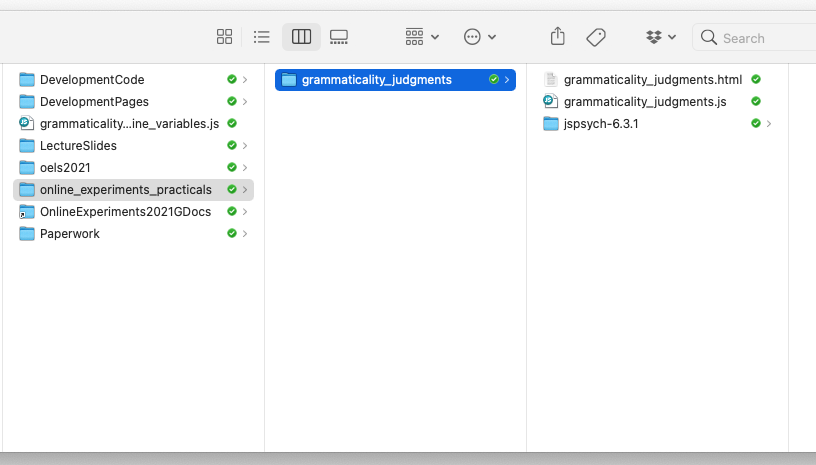

## The plan for week 3 practical

This week we are going to look at code for a simple grammaticality judgment experiment. Remember, the idea is that you can work through these practicals in the lab classes and, if necessary, in your own time - I recommend you use the lab classes as dedicated time to focus on the practicals, with on-tap support from the teaching team. 


## A grammaticality judgment experiment

By this point you know enough of the basics of jsPsych and javascript to work with a simple experiment. I'd like you to download and run the code I provide, look at how the code works, and then attempt the exercises below, which involve editing the code in simple ways.

You need two files for this experiment, which you can download through the following two links:
- <a href="code/grammaticality_judgments/grammaticality_judgments.html" download> Download grammaticality_judgments.html</a>
- <a href="code/grammaticality_judgments/grammaticality_judgments.js" download> Download grammaticality_judgments.js</a>

The code makes some assumptions about where you will save it - you can change that if you want but then you'd have to edit the code so it is looking in the right place, so it might be simpler to copy my directory structure. If you haven't already, create a directory (also known as a folder) called e.g. `online_experiments_practicals`. Then create a new folder inside the `online_experiments_practicals` folder called `grammaticality_judgments`, move the two files you just downloaded in there , and also put a copy of the jsPsych code you downloaded in week 1 (for me that folder is called `jspsych-6.3.1`) in there too. So if you do that all correctly you will have a folder called `online_experiments_practicals` that has a single sub-folder called `grammaticality_judgments`, containing a copy of the jsPsych source code and then the grammaticality judgments code. On my mac it looks like this.



The idea is that every week will will add a new subfolder to the `online_experiments_practicals` folder containing new code for a new experiment and its own separate copy of the jsPsych source code. You may think it's a bit redundant to have a separate copy of jsPsych with each experiment, but this redundancy is the point - the intention is that each experiment folder is its own self-contained unit containing all the code it needs to run, then you don't need to keep track of what *else* you need to copy to if you want to move, copy pr share an experiment. 

Assuming you have the directory structure all right, this code should run on your local computer (just open the `grammaticality_judgments.html` file in your browser) or you can upload it to the jspsychlearning server and play with it there, using the same sort of directory structure - it needs to be in `public_html`, e.g. if you have exactly the same directory structure on the server then the code would be in `public_html/online_experiments_practicals/grammaticality_judgments/`, and the URL for your experiment would be http://jspsychlearning.ppls.ed.ac.uk/~UUN/online_experiments_practicals/grammaticality_judgments/grammaticality_judgments.html (where UUN is your student number, s21... or whatever). 

First, get the code and run through it so you can check it runs, and you can see what it does. Then take a look at the HTML and js files in your code editor (we are recommending Visual Studio Code).

You will see that `grammaticality_judgments.html` doesn't have much in it - all that does is use the `<script>...</script>` tag to load a couple of plugins plus the file `grammaticality_judgments.js`.

The bulk of the code is in `grammaticality_judgments.js`. You will see that that code includes *comments* - these are bits of text that are enclosed in special markers so that the machine running the code ignores them. They are intended for you to read, to explain what the code is doing. But I'll also add some explanation here.

`grammaticality_judgments.js` is probably one of the simplest types of experiments you could build. It has 4 grammaticality judgment trials, where participants provide a keypress response: y or n for "yes, this sentence could be spoken by a native speaker of English" or "no, it could not". Note that is slightly different from what Sprouse (2011) does - he asks people for a numerical response rather than a simple yes-no, we'll come to that later.

There is also a little bit of wrapper around those 4 trials - a consent screen where participants click a button to give consent and proceed to the experiment, some information screens before the experiment proper starts, and then a final screen where you can display debrief information, completion codes etc to participants.

The code starts by laying out the grammaticality judgment trials. Note that just because they come first in the javascript file doesn't mean they will be the first thing the participant sees - the timeline controls what participants see when. Each judgment trial involves showing the participant a sentence and getting a single keypress response from them, which we can achieve using the `html-keyboard-response` plugin from jsPsych. Details of the options for that plugin are in the [jsPsych documentation](https://www.jspsych.org/plugins/jspsych-html-keyboard-response/). We are using the `stimulus` parameter to hold the sentence the participant is judging, `prompt` reminds the participant what they are supposed to be doing, and `choices` shows the list of keyboard responses they are allowed to provide - in this case we only accept y or n keypresses, so everything else is ignored. So the code for one judgment trial looks like this:

```js
var judgment_trial_1 = {
    type: 'html-keyboard-response',
    stimulus: "Where did Blake buy the hat?",
    prompt: "<p><em>Could this sentence be spoken by a native speaker of English? Press y or n</em></p>",
    choices: ['y','n']
};
```

The only slightly fancy thing in there is that in the prompt I am using some HTML tags - the `<p>...</p>` tag to put the prompt in its own paragraph (it vertically separates the prompt from the stimulus a bit, which I think looks better) and also the `<em>...</em>` tag to make the prompt in italics (again, to visually separate it from the stimulus sentence - em stands for *emphasis* I think).

The code defines 4 such trials, inspired by the type of sentences used in Sprouse (2011).

That's basically the only interesting part of the code! But we also need some preamble for the participants. Most experiments start with a consent screen, where participants read study information and then consent to participate. I include a placeholder for this consent screen using the `html-button-response` plugin - you see the consent information and then click a button to indicate that you consent. The code for that looks as follows:

```js
var consent_screen = {
  type: 'html-button-response',
  stimulus: "<h3>Welcome to the experiment</h3>\
  <p style='text-align:left'>Experiments begin with an information sheet that explains to the participant\
  what they will be doing, how their data will be used, and how they will be\
  remunerated.</p>\
  <p style='text-align:left'>This is a placeholder for that information, which is normally reviewed\
  as part of the ethical review process.</p>",
  choices: ['Yes, I consent to participate'],
};
```

You will notice that the `stimulus` parameter here is quite complicated - it includes some HTML markup, including tags for headers (`<h3>` and `</h3>` to start and end a header), and paragraphs (`<p>` ... `</p>`). By default, jsPsych centers all text, which sometimes looks fine (e.g. for the judgment trials, where we *want* the stimulus to be centered) but it looks terrible for instruction text, so I also tell it to left-align that text, by adding some stuff inside the paragraph tags - I start a left-aligned paragraph with `<p style='text-align:left'>`, then end it with `</p>` as usual. Finally, the `choices` parameter for this trial type is a list of button labels - lists are enclosed in square brackets, here the list contains exactly one option with the "yes I consent" text, which produces a screen with exactly one button to be clicked. Finally, I have to use a backslash (`\`) character whenever I want to include a line break in the stimulus string, otherwise javascript thinks there is a syntax error.

I also define some information screens - these are also `html-button-response` trials, just like the consent screen. So for example the first instruction screen looks like this:

```js
var instruction_screen_1 = {
  type: 'html-button-response',
  stimulus: "<h3>Instructions</h3> \
  <p style='text-align:left'>In this experiment you will read English sentences, and determine if they sound\
  grammatical to you. By grammatical, we mean whether you think a native speaker of\
  English could say this sentence in a conversation. In other words, do you think it\
  would sound odd for your friends to say this to you, as if they don't speak English natively?</p>\
  <p style='text-align:left'>We are <b>not</b> concerned with whether the sentence would be graded highly\
  by a writing teacher: we do not care about points of style or clarity, and we do\
  not care about the grammar rules that you learned in school (who versus whom,\
  ending a sentence with a preposition, etc). Instead, we are interested in whether\
  these sentences could be said by a native speaker of English in normal daily speech.</p>",
  choices:["Click to proceed to the next page"]
};
```

That's quite a lot of text, but it's just a very simple button response trial with a long bit of HTML-formatted bit of text to display. There are several other options for instruction screens - `html-keyboard-response` would be OK (although I find it's a bit too easy to advance through lots of those by mashing the keyboard), or jsPsych provides [an instructions plugin](https://www.jspsych.org/plugins/jspsych-instructions/) which allows you to specify multiple pages in a single trial and gives participants the ability to scroll forwards and backwards through those pages. 

Once all the various trials are defined, we can stick them together in a timeline for the experiment. The timeline is very simple and is just a list of all the trials we have created up to this point:
```js
var full_timeline = [consent_screen,instruction_screen_1,instruction_screen_2,
                    judgment_trial_1,judgment_trial_2,judgment_trial_3,judgment_trial_4,
                    final_screen];
```

Then to run the experiment we call `jsPsych.init` with this `full_timeline` variable we have created. We also tell it to show the raw data on-screen at the end of the experiment (using the `on_finish` parameter of `jsPsych.init`). Obviously in a real experiment you would save the data rather than just showing it back to the participant, we'll show you how to do that later in the course!

```js
jsPsych.init({
    timeline: full_timeline,
    on_finish: function(){jsPsych.data.displayData('csv')}
});
```


## Exercises with the grammaticality judgment experiment code

Attempt these problems.

- How would you add extra judgment trials to this code, to ask people about the grammaticality of some additional sentences? Try adding a few new judgment trials.
- Have a look at the data that is displayed at the end of the experiment. This is in comma-separated format, so a series of columns separated by commas, the very first row of the data gives you the column names. Can you see where the stimulus and the response for each trial is recorded? Is there anything in the data you weren't expecting or don't understand?
- Can you change the information screens so that participants progress to the next screen by pressing any key on the keyboard? 
- Can you change the judgment trials so participants can provide a single-digit numerical response, e.g. any number between 1 and 9, rather than simply allowing y or n as valid responses? That numerical response could indicate a more continuous scale of grammaticality, a bit more like Sprouse's magnitude estimation task.
- Can you change the judgment trials so the participants provide their responses by clicking yes/no buttons, rather than using the keyboard? (Hint: look at how I did the button on the consent screen)
- How would you use buttons to provide a wider range of responses (e.g. "completely fine", "a little strange", "very strange", ...)?
- [More challenging] Sprouse (2011) actually uses a rather different layout and type of response: he has participants enter a numerical value for each sentence, has multiple judgments presented on a single page, and provides a reference sentence (e.g. an example sentence which should receive a score of 100) at the top of each page. Can you replace our simple yes/no judgment trials with something more like what Sprouse did, using the jsPsych [survey-text plugin](https://www.jspsych.org/plugins/jspsych-survey-text/)?

## Optional: a version of the code using timeline variables

You might have noticed that in `grammaticality_judgments.js` we quite laboriously lay out 4 judgment trials, all of which are identical in structure apart from the `stimulus` parameter. There are a couple of more efficient ways to do this, one of which is by using jsPsych timeline variables. If you'd like to see how that's done, download and inspect the file <a href="code/grammaticality_judgments/grammaticality_judgments_with_timeline_variables.js" download> grammaticality_judgments_with_timeline_variables.js</a>, stick it in your `grammaticality_judgments` folder, then see if you can get that to run by telling `grammaticality_judgments.html` to load the timeline javascript file rather than the basic one (by editing line 9 of the html file).

You might be wondering what the advantage of using this slightly fancier code is, and/or thinking "I could just copy and paste the judgment trials and edit them directly, isn't that simpler?". It maybe is conceptually simpler to copy and paste simple code, but it's also more error prone, since it relies on you not making any mistakes in copying, pasting and editing the same little block of code over and over again. In general, if you find yourself doing a lot of copying, pasting and editing when writing code it's a sign that you are doing something manually that the computer could do for you automatically, more quickly and with less chance of errors. We'll come back to that next week when we look at self-paced reading, where the "simple" manual approach would produce some really unwieldy code.


## Re-use

All aspects of this work are licensed under a [Creative Commons Attribution 4.0 International License](http://creativecommons.org/licenses/by/4.0/).
