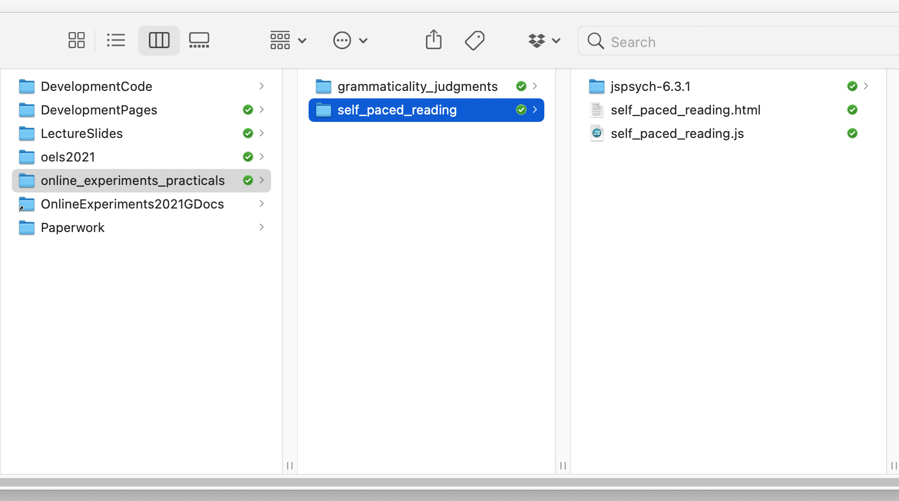

## The plan for week 4 practical

This week we are going to look at code for a simple self-paced reading experiment - as you should know from the reading this week, in a self-paced reading experiment your participants read sentences word by word, and you are interested in where they are slowed down (which might indicate processing difficulties). We therefore care about reaction times (which we didn't for our grammaticality judgments task last week, although jsPsych collected them for us anyway). We are also going to see some slightly more complex timelines, with trials that consist of several parts and even a javascript function that simplifies the process of building those complex trials for us. Finally, I'll add an example at the end of how to collect demographic info from your participants, which is often something you want to do.

Remember, as usual the idea is that you can work through these practicals in the lab classes and, if necessary, in your own time - I recommend you use the lab classes as dedicated time to focus on the practicals, with on-tap support from the teaching team. 

## A refresher on debugging and some JavaScript concepts

Alisdair will talk through an experiment which illustrates:
- The basics of using `for` loops to loop through an array.
- The basics of JavaScript functions - what a function looks like, and how you make a function return a value.
- Debugging (including Developer Tools in your browser)

The experiment is here: <a href="https://softdev.ppls.ed.ac.uk/online_experiments/example_src/debugging/debugging_example.html">debugging_example.html</a>. You don't need to download it, you can follow along with the example on the server by clicking on the link. (You won't see anything to start with as there are some bugs in it - that's deliberate!)

You may also find it useful to look back through [section 05 of Alisdair's Online Experiments with jsPsych tutorial](https://softdev.ppls.ed.ac.uk/online_experiments/05_javascript.html) as you're working on this week's task.

## A self-paced reading experiment

By this point you are equipped to look at a simples self-paced reading experiment - the main part of the experiment uses a plugin you are already familiar with (`html-keyboard-response`), so the new content is that I am going to show you how to use a little bit of javascript (an array, a loop, a function) to make building a complex trial list a bit easier.

### Getting started

As per last week, I'd like you to download and run the code I provide, look at how the code works, and then attempt the exercises below, which involve editing the code in simple ways and puzzling over the output.

You need two files for this experiment, which you can download through the following two links:
- <a href="code/self_paced_reading/self_paced_reading.html" download> Download self_paced_reading.html</a>
- <a href="code/self_paced_reading/self_paced_reading.js" download> Download self_paced_reading.js</a>

Again, the code makes some assumptions about the directory structure it's going to live in - regardless of whether you are putting this on your own computer or on the jspsychlearning server, these should sit in a folder called something like `self_paced_reading`, alongside your `grammaticality_judgments` folder from last week, and your `self_paced_reading` folder needs to include its own copy of `jspsych-6.3.1` - so your folder will now look something like this.



Assuming you have the directory structure all right, this code should run on your local computer (just open the `self_paced_reading.html` file in your browser) or you can upload the whole `self_paced_reading` folder to the public_html folder on the jspsychlearning server and play with it there (if your directory structure on the server is the same as suggested above, the url for your experiment will be http://jspsychlearning.ppls.ed.ac.uk/~UUN/online_experiments_practicals/self_paced_reading/self_paced_reading.html).

First, get the code and run through it so you can check it runs, and you can see what it does. Then take a look at the HTML and js files in your code editor (e.g. Visual Studio Code).

### Nested timelines

Each individual trial in a self-paced reading experiment is actually rather complex: it involves word-by-word presentation of a sentence, followed by a comprehension question - the comprehension questions are there to prevent participants just rattling through the sentence without actually reading it.

The way we are going to do this in jsPsych is to have multiple trials per sentence: one trial for each word in that sentence, and then a final trial for the comprehension question. These are all `type:'html-keyboard-response'` - for the word-by-word presentation we just want the participant to hit spacebar to progress, then we will make the comprehension question a yes/no answer (basically just like in the grammaticality judgments code from last week).

We *could* do this all manually, and just specify a huge long trial list like this:

```js

var spr_trial_the_basic_way = [
{type: 'html-keyboard-response',
  stimulus:'A',
  choices: [' ']},
{type: 'html-keyboard-response',
  stimulus:'self-paced',
  choices: [' ']},
{type: 'html-keyboard-response',
  stimulus:'reading',
  choices: [' ']},
{type: 'html-keyboard-response',
  stimulus:'trial',
  choices: [' ']},
{type: 'html-keyboard-response',
  stimulus:"Was that a self-paced reading trial?",
  prompt:"<p><em>Answer y for yes, n for no</em></p>",
  choices:['y','n']}
];
```

That will present the sentence "A self-paced reading trial" one word at a time,
waiting for a spacebar response after each word, then present a y/n comprehension question at the end. However, that is quite unwieldy - there is lots of redundant information (we have to specify every time the trial type, the spacebar input), building the trial list for a long experiment with hundreds of sentences is going to be very error prone, and it would be impossible to randomise the order without messing everything up horribly!

Thankfully jsPsych provides a nice way around this. A slightly more sophisticated solution involves using nested timelines (explained under *Nested timelines* in [the relevant part of the jsPsych documentation](https://www.jspsych.org/6.3/overview/timeline/#nested-timelines): we create a trial which has its own timeline, and then that timeline is expanded into a series of trials, one trial per item
in the timeline (so each of these complex trials functions a bit like its own stand-alone embedded experiment with its own timeline). We can use nested timelines to form a more compressed representation of the long trial sequence above and get rid of some of the redundancy.

The simplest way to do this is to split the long sequence for a single self-paced reading trial into a pair of trials: the self-paced reading part, which has its own nested timeline of several words, and then the comprehension question. That would look like this:

```js
var spr_trial_using_nested_timeline = [
  {type: 'html-keyboard-response',
   choices: [' '],
   timeline: [{stimulus:"A"},{stimulus:"self-paced"},{stimulus:"reading"},{stimulus:"trial"}]},
  {type: 'html-keyboard-response',
   stimulus:"Was that a self-paced reading trial?",
   prompt:"<p><em>Answer y for yes, n for no</em></p>",
   choices:['y','n']}];
```

`spr_trial_using_nested_timeline` is a list of two trials (those two trials are enclosed in square brackets `[...]`, because that's how we represent lists). The first trial is an `html-keyboard-response` trial, which accepts space as the only valid input, and which has a nested timeline specifying the only thing that differs between the sub-trials, the `stimulus` - each item in the nested timeline gets the `type` and `choices` parameters from its parent, and differs only in its `stimulus`, so when the nested timeline is run we end up with our sentence presented in a sequence of 4 trials. Then the second trial in `spr_trial_using_nested_timeline` is the comprehension question, another `html-keyboard-response` trial but no nested timeline and looking for a y-n response.

I find that quite clear to look at, but you'll notice that there's still some redundancy (we have to specify twice that type is `html-keyboard-response`). Plus our trial list, `spr_trial_using_nested_timeline`, is just producing a flat array of reading trials then a comprehension question - you could imagine that if we extended that to contain e.g. 6 sentence presentations and 6 questions, and if we wanted to randomise the order somehow, we might accidentally separate a sentence and its comprehension question.

There is an even more compressed way of representing this trial sequence, which looks like this:

```js
var spr_trial_using_very_nested_timeline =
[{type: 'html-keyboard-response',
  timeline: [
    {choices: [' '],
     timeline: [{stimulus:"A"},{stimulus:"self-paced"},{stimulus:"reading"},{stimulus:"trial"}]},
     {stimulus:"Was that a self-paced reading trial?",
      prompt:"<p><em>Answer y for yes, n for no</em></p>",
      choices:['y','n']}]}];
```

So that's a single `html-keyboard-response` trial which has a nested timeline; the first item in the nested timeline is the spacebar-response trials, which itself has a nested timeline, and then the second item in the timeline is a single trial with different `choices`, `stimulus` and `prompt`. Personally I find that slightly more confusing to look at in the code, but I like that what is conceptually a single trial - a sentence plus its comprehension question - is now a single (quite complex!) trial in the experiment.

It's important to emphasise that these three ways of representing a self-paced reading trial all work, and look the same from the participant perspective - which one you choose might be decided by things like what you plan to do for randomisation, or how confident you are that you understand what the nested trial lists are doing!

Nested trial lists therefore make it quite easy to build a single self-paced reading trial. However, it's still going to be a bit laborious to build a sequence of such trials. In order to build two trials we'd have to do something like this:

```js
var two_spr_trials =
[
  {type: 'html-keyboard-response',
    timeline: [
      {choices: [' '],
       timeline: [{stimulus:"A"},{stimulus:"self-paced"},{stimulus:"reading"},{stimulus:"trial"}]},
       {stimulus:"Was that a self-paced reading trial?",
        prompt:"<p><em>Answer y for yes, n for no</em></p>",
        choices:['y','n']}]},
  {type: 'html-keyboard-response',
    timeline: [
      {choices: [' '],
       timeline: [{stimulus:"Another"},{stimulus:"self-paced"},{stimulus:"reading"},{stimulus:"trial"}]},
       {stimulus:"Trick question: wasn't that a self-paced reading trial?",
        prompt:"<p><em>Answer y for yes, n for no</em></p>",
        choices:['y','n']}]}
];
```

So that's a list of two trials, both of which are identical in all their details
except for the word list and the comprehension question. Building a long list
of trials like that is definitely do-able, but is probably quite error prone - to change the word list or the comprehension question I have to jump into exactly the right spot in the nested timelines and change the right thing, and inevitably I will forget at some point or make a mistake. Plus it's an entirely mechanical process - if you know the sentence it's obvious how to slot it into our trial template - and computers are good at doing mechanical stuff methodically, so it makes more sense to automate this.

What we'll do is use a little bit of javascript and write a function which
takes a sentence and a comprehension question and uses this template to build a
trial. It splits the sentence into an array of words (splitting the sentence at
the spaces using a built-in javascript function called `split`), and then uses a
little `for` loop to build the word-by-word stimulus list. Then it slots that
word-by-word stimulus list plus the comprehension question into our trial template, and returns that trial.

Here's the function. I have called it `make_spr_trial` (spr = self-paced reading), and it takes two arguments (also sometimes known as *parameters*, e.g. in section 05 of the tutorial): a sentence to present word by word, and a yes-no comprehension question.

```js

function make_spr_trial(sentence,comprehension_question) {
  var sentence_as_word_list = sentence.split(" "); //split the sentence at spaces
  var sentence_as_stimulus_sequence = []; //empty stimulus sequence to start
  for (var word of sentence_as_word_list) { //for each word in sentence_as_word_list
    sentence_as_stimulus_sequence.push({'stimulus':word}) //add that word in the required format
  }
  var trial = {type: 'html-keyboard-response', //plug into our template
               timeline:[{choices: [' '],
                         timeline: sentence_as_stimulus_sequence},
                         {stimulus:comprehension_question,
                          choices:['y','n'],
                          prompt:"<p><em>Answer y or n</em></p>"}
                        ]};
  return trial; //return the trial you have built
}
```

Now it is very easy to build multiple trials using this function. Note that the arguments we pass in - the sentence and the comprehension question - are strings, so enclosed in quotes.

```js
var spr_trial_1 = make_spr_trial("A self paced reading trial","Was this a self paced reading trial?");
var spr_trial_2 = make_spr_trial("Another self paced reading trial","Trick question: Wasn't this a self paced reading trial?");
```

### Other bits and pieces, including collecting demographics

As usual, your experiment will need a consent screen and some instruction screens. Those bits are basically the same as last week so I won't bother showing the code here, but note that jsPsych provides an instructions plugin (https://www.jspsych.org/6.3/plugins/jspsych-instructions/) which might be better if you were providing several pages of instructions.

For this experiment I have also added a trial (just before our very final `final_screen` trial) where we collect some additional info from the participant. Often you want to collect demographic information from your participants - e.g. age, gender, whether they are a native speaker of some language - and give them the opportunity to provide free-text comments (e.g. in case there is a problem with your experiment that they have noticed). In general you shouldn't collect data you don't actually need - it wastes the participants' time, potentially means you are storing unnecessary personal information about your participants, and also opens up various temptations at analysis time ("Hmm, this experiment doesn't looked like it worked, how boring. But wait! If I split it by gender and age, which I collected for no real reason, then I get a weird pattern of significant results, maybe I can pretend I predicted that all along and publish this?"). Plus Prolific already has gender and age data for your participants (we'll show you how to access that in the final week), so you don't need to collect it yourself. So don't feel you always need to include the exact questions I have put here, these are just some examples of how to collect some common response types. 

The [survey-html-form](https://www.jspsych.org/6.3/plugins/jspsych-survey-html-form/) plugin provides a way to mix various response types on a single form - in this example I am going to include a radio-button response (select one from a number of options), a text-box response that only accepts numbers, and a larger text box for more open comments. But there are lots of other options - if you are wondering "can I do X?", look at the documentation for the [input](https://developer.mozilla.org/en-US/docs/Web/HTML/Element/input), [textarea](https://developer.mozilla.org/en-US/docs/Web/HTML/Element/textarea) and [select](https://developer.mozilla.org/en-US/docs/Web/HTML/Element/select) tags.

We include our demographics questionnaire by creating a single trial - note that it has `type: 'survey-html-form'`, and in my html file I therefore have to load the appropriate plugin (line 8 of `self_paced_reading.html` does that).

```js
var demographics_form = {
  type: 'survey-html-form',
  preamble: "<p style='text-align:left'> Please answer a few final questions about yourself and our experiment.</p>",
  html:"<p style='text-align:left'>Are you a native speaker of English?<br>  \
            <input type='radio' name='english' value='yes'>yes<br>\
            <input type='radio' name='english' value='no'>no<br></p> \
        <p style='text-align:left'>What is your age? <br> \
            <input name='age' type='number'></p> \
        <p style='text-align:left'>Any other comments?<br> \
            <textarea name='comments' rows='10' cols='60'></textarea></p>"
};
```

The interesting stuff happens in the `html` parameter of this trial, so I'll break that down for you. Once again this is a string (enclosed in double quotes) that includes some HTML markup tags. The simplest part of that is the the bit of code that collects the age info:

```js
"<p style='text-align:left'>What is your age? <br> \
    <input required name='age' type='number'></p>"
```

So it's a paragraph (enclosed in `<p> ... </p>`), and I have used `style='text-align:left'` to make it left-justified so it doesn't look too awful. There's a question ("What is your age?"), then a `<br>` tag to produce a line break. Then `<input required name='age' type='number'>` creates an input field, which will be referred to as `age` in our code (that's how it appears in the results, as you will see later), and we tell it that this trial is of the `number` type, which lets the browser know how to display it (e.g. if we swap `type='number'` for `type='text'` then you lose the little scroller to increase/decrease the number). The `required` flag means that this response has to be provided - your participants will not be allowed to progress unless they provide a response. You can similarly make radio buttons, check boxes and text area inputs required (in the same way, by adding this `required` flag), but use it sparingly - e.g. if you make an open-ended comment obligatory that is likely to annoy people.

The comments box is the same idea, but instead of using an `<input>` tag we are using `<textarea><\textarea>`. Note that there is nothing between those tags - if you put in some text (e.g. `<textarea>Initial text<\textarea>`) then that would appear in your textbox without needing to be typed in by the participant, which is not really useful for us here. We can also specify the size of the box in rows and columns - people often take their cue about the length of the response desired based on the size of the box.

The radio buttons (yes vs no for "Are you a native speaker of English?") are slightly more complex. The relevant part looks like this:

```js
"<input type='radio' name='english' value='yes'>yes<br>\
<input type='radio' name='english' value='no'>no<br>"
```

So that is two input fields, one for yes and one for no, but they have the same name (`name='english'`). The browser knows in those circumstances to only allow people to select *one* option from among those options that share the same name. Then we have `value='yes'` for the yes input and `value='no'` for the no input - this is the response *that will be recorded* depending on which button the participant selects (if you leave the `value` bit out then the code records a very unhelpful answer of "english=on", i.e. it just tells you that the participant answered the question but not which answer they gave). Then finally we have the text that appears alongside the button, yes and no respectively, with a `<br>` in between the buttons to make it look nice.

### The full timeline

The full timeline for this simple 2-trial experiment then looks like this:

```js
var full_timeline = [consent_screen,instruction_screen_1,
                     spr_trial_1,spr_trial_2,
                     demographics_form,
                     final_screen];
```

And then we use `jsPsych.init` to run it - again,  nothing fancy going on here, and we are just dumping the data to the display at the end. Next week I'll show you how to do something a bit more useful with the data, i.e. save it as a CSV file.

```js
jsPsych.init({
    timeline: full_timeline,
    on_finish: function(){jsPsych.data.displayData('csv')}
});
```

## Exercises with the self-paced reading experiment code

Attempt these problems.

- How would you add extra trials to this code, i.e. additional sentences and related comprehension questions? Replace my silly placeholder sentences with some more appropriate ones, e.g. inspired by the items in Table 2 of Enochson & Culbertson (2015).
- Add another demographics question, e.g. a text box to list other languages spoken, or some additional radio buttons with more than 2 options.
- Have a look at the data that is displayed at the end of the experiment. Can you see where the stimulus for each trial is recorded? Can you see where the crucial reaction time data for each trial is recorded? Can you see how the demographics data is recorded? Can you work out what the "internal_node_id" column is doing (which looks like e.g. "0.0-2.0-0.0-0.0" ... "0.0-2.0-0.0-1.0 ... "0.0-2.0-0.0-2.0")?
- If you were going to analyse this kind of data, you would need to pull out the relevant trials (i.e. the ones involving self-paced reading, and comprehension questions). Is it going to be easy to do that based on the kind of output the code produces? How would you identify those trials? If you were particularly interested in certain words in certain contexts, is it going to be easy to pull those trials out of the data the code produces?
- [Optional, challenging] An alternative to self-paced reading is the Maze task (e.g. Forster et al., 2009; Boyce et al., 2020); like self-paced reading your participants work through a sentence word by word, but unlike in self-paced reading at each step they chose one of two continuations for the sentence (see image below from Boyce et al., 2020 - G-Maze refers to mazes where the distractors are English words which would be ungrammatical continuations, L-maze has non-word distractors). Can you convert the self-paced reading code to run a maze task? For each word presentation you will need an alternative continuation, and some way of the participant selecting their continuation (e.g. keyboard? button?). Maze tasks also don't feature comprehension questions so you can drop those (the idea is that selecting the correct continuation throughout shows you are paying attention). Mazes also abort the sentence when the participant makes a mistake - we haven't covered this yet and it is somewhat tricky, so I would suggest skipping this feature of the maze for now, but is possible using `on_finish` and  `jsPsych.endCurrentTimeline` (see example in [jsPsych core documentation](https://www.jspsych.org/6.3/core_library/jspsych-core/)).


## References

[Boyce, V., Futrell, R., & Levy, R. P. (2020). Maze Made Easy: Better and easier measurement of incremental processing difficulty.
*Journal of Memory and Language, 111,* 104082.](https://doi.org/10.1016/j.jml.2019.104082)

[Enochson, K., & Culbertson, J. (2015). Collecting Psycholinguistic Response Time Data Using Amazon Mechanical Turk.
*PLoS ONE, 10,* e0116946.](https://doi.org/10.1371/journal.pone.0116946)

[Forster, K. I., Guerrera, C., & Elliot, L. (2009). The maze task: Measuring forced incremental sentence processing time.
*Behavior Research Methods, 41,* 163-171.](https://doi.org/10.3758/BRM.41.1.163)

## Re-use

All aspects of this work are licensed under a [Creative Commons Attribution 4.0 International License](http://creativecommons.org/licenses/by/4.0/).
