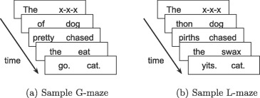

## The question

In the week 4 practical I set the following problem - note that it's marked as optional and challenging!

- [Optional, challenging] An alternative to self-paced reading is the Maze task (e.g. Forster et al., 2009; Boyce et al., 2020); like self-paced reading your participants work through a sentence word by word, but unlike in self-paced reading at each step they chose one of two continuations for the sentence (see image below from Boyce et al., 2020 - G-Maze refers to mazes where the distractors are English words which would be ungrammatical continuations, L-maze has non-word distractors). Can you convert the self-paced reading code to run a maze task? For each word presentation you will need an alternative continuation, and some way of the participant selecting their continuation (e.g. keyboard? button?). Maze tasks also don't feature comprehension questions so you can drop those (the idea is that selecting the correct continuation throughout shows you are paying attention). Mazes also abort the sentence when the participant makes a mistake - we haven't covered this yet and it is somewhat tricky, so I would suggest skipping this feature of the maze for now, but is possible using `on_finish` and  `jsPsych.endCurrentTimeline` (see example in [jsPsych core documentation](https://www.jspsych.org/6.3/core_library/jspsych-core/)).



How would you adapt the self-paced reading code we gave you to do this? The first most obvious problem is that the self-paced reading code presents a single word on-screen at each reading trial, but here you want 2 - the correct continuation and the distractor (for ease I'll use non-word distractors, so I'll give you code for an L-maze, but changing it to a G-maze just involves plugging in different distractors). So we need a way to pass two options in to be paired up and displayed on screen somehow. 

There are a couple of ways (at least!) we could do this, I'll show you them below. Ideally we'd also show those two options on screen in random order, rather than e.g. always the correct option on the left (which participants would quickly notice!), so I'll implement that too. In terms of how participants give their responses, we could get them to click on buttons (so the two possible continuations are the two buttons they see), or we could show the two words on the left and right and get a key-press to indicate which continuation the participant wants (e.g. z key to indicate the left continuation, m key for the right, since those are keys on the left and right of a QWERTY keyboard respectively). Finally, following my suggestion, I am going to skip the code for aborting a trial when the participant gives an incorrect response - but in the next practical you'll see how to do contingent trials where what a participant selects on one trial influences what they see next, which would be a crucial ingredient of the trial-aborting process.

## Option 1: two lists

One way to pass in two options for every reading trial (the correct continuation plus a non-word distractor) is just to pass in two lists of words - one is the list of correct continuations, the other is the list of distractors. For instance, if we want our correct continuations to be "The" "dog", "chased", "the" and "cat" (i.e. the sentence is "The dog chased the cat." as in the L-maze image above) and our distractors are "x-x-x", "thon", "pirths", "swaz", and "yits" (i.e. just a sequence of non-words of the same length), we could represent those two sets of options like this:

```js
var correct_continuations = ["The","dog","chased","the","cat."];
var distractors =           ["x-x-x","thon","pirths","swax","yits."];
```

Then we'll need to work through both lists so that on the first trial we display the first item from both lists (so the participant chooses between "The" and "x-x-x"), on the second trial we display the second item from both lists ("dog" vs "thon") and so on. That's nice and easy with a for-loop where we count through the positions in the list, pairing up the items as we go. So we could write a `make_maze_trial` function that does this for us - we give it two lists, it uses a for-loop to work through them and pair up our items. At this point I have to decide what kind of response I am going to take - for this implementation I will use `html-button-response`, the word choices will be the buttons (and the html will just be an instruction to select a continuation). So the two options on every trial will end up being the `choices` parameter. The code for that would look something like this:

```js
function make_maze_trial(sentence_as_word_list,distractors_as_word_list) {
  var choices_sequence = []; //empty choice sequence to start
  for (var i=0;i<sentence_as_word_list.length;i++) { //for each value of the counter i=0 to i=length-1
    correct_continuation = sentence_as_word_list[i];
    incorrect_continuation = distractors_as_word_list[i];
    ordered_choices = [correct_continuation,incorrect_continuation]; //put the two options together
    choices_sequence.push({'choices':ordered_choices}); //these will be our choices
  }
  var trial = {type: 'html-button-response', //make an html-button-response trial with an embedded timeline
               timeline:[{stimulus: "<em>Select a continuation</em>", //boring stimulus
                         timeline: choices_sequence}]}; //each trial varies in the choices offered
  return trial; //return the trial you have built
};
```

To use this to generate our trial we would then do:
```js
var maze_trial_1 = make_maze_trial(["The","dog","chased","the","cat."],["x-x-x","thon","pirths","swax","yits."]);
```

This is very similar to the `make_spr_trial` function we used in the main code, except that:

- Rather than passing in a sentence represented as a single string (e.g. `"The dog chased the cat"`) and then splitting it up into a list of words (`["The","dog","chased","the","cat"]`) using `split`, I am just passing it in straight away in the format I need. I liked the idea of passing in a proper sentence in the original self-paced reading code, but that makes less sense when we are dealing with *two* lists, one of which is all non-words.
- There are two ways of doing for-loops in javascript - the `for (word of list)` way, where you work through the items in a list in turn, and the index-based approach which I am using here (`for (var i=0;i<sentence_as_word_list.length;i++)`) where we create a counter and then work through the list based on position-number (position 0 is the first thing in the list, position 1 is the second thing, etc). We covered these two kinds of for-loops, and how to use a number to retrieve a specific position in a list, in [section 05 of Alisdair's tutorial](https://softdev.ppls.ed.ac.uk/online_experiments/05_javascript.html), under "Arrays" and "Looping through an array".
- Once I have looked up the correct continuation and the incorrect continuation, I put them together in a list which I am calling `ordered_chocies`, then using that as the `choices` parameter for each trial in my nested timeline.

That would be OK, *but* the corrcet continuation would always be on the left, which is a bit rubbish. Instead we can use a built-in jspsych function, `jsPsych.randomization.shuffle`, to shuffle the `ordered_choices` variable so that the correct continuation will sometimes be on the left and sometimes on the right. That revised function looks like this:

```js
function make_maze_trial(sentence_as_word_list,distractors_as_word_list) {
  var choices_sequence = []; //empty stimulus sequence to start
  for (var i=0;i<sentence_as_word_list.length;i++) { //for each value of the counter i=0 to i=length-1
    correct_continuation = sentence_as_word_list[i];
    incorrect_continuation = distractors_as_word_list[i];
    ordered_choices = [correct_continuation,incorrect_continuation]; //put the two options together
    shuffled_choices = jsPsych.randomization.shuffle(ordered_choices); //randomise the order
    choices_sequence.push({'choices':shuffled_choices}); //these will be our choices
  }
  var trial = {type: 'html-button-response', //make a trial with an embedded timeline
               timeline:[{stimulus: "<em>Select a continuation</em>",
                         timeline: choices_sequence}]};
  return trial; //return the trial you have built
};
```

You can download all the code for this implementation through the following two links:
- <a href="code/maze/maze_twolist.html" download> Download maze_twolist.html</a>
- <a href="code/maze/maze_twolist.js" download> Download maze_twolist.js</a>

If you drop these into your `self_paced_reading` folder they will be able to access the copy of `jspsych-6.3.1` that's already there.

# Option 2: one list of pairs

Option 1 is OK, but I don;t love the fact that the correct and incorrect continuations are in completely seperate lists - so e.g. if I want to see which distractor is going to be paired with "sat" I have to count through the lists. An alternative is to pass our `make_maze_trial` function a single list which contains all the words already paired up. That is actually really easy to do because lists can themselves contain lists - so we can have a list of items, where each item in that list is itself a list containing the correct continuation and its associated distractor. That would be represented as follows:

```js
var one_list = [["The","x-x-x"],["dog","thon"],["chased","pirths"],["the","swax"],["cat.","yits."]];
```

So `one_list` is a list of 6 items, each of which is a list containing the correct continuation and the distractor it is to be shown with. We could then use a for-loop to work through this list, simply shuffling each pair and using them as the `choices` parameter in our reading trials as we go, like this:

```js
function make_maze_trial(sentence_distractor_pairs) {
  var choices_sequence = []; //empty stimulus sequence to start
  for (ordered_choices of sentence_distractor_pairs) {
    shuffled_choices = jsPsych.randomization.shuffle(ordered_choices); //randomise the order
    choices_sequence.push({'choices':shuffled_choices}); //these will be our choices
  }
  var trial = {type: 'html-button-response', //make a trial with an embedded timeline
               timeline:[{stimulus: "<em>Select a continuation</em>",
                         timeline: choices_sequence}]};
  return trial; //return the trial you have built
};
```

Then we use like this:
```js
var maze_trial_1 = make_maze_trial([["The","x-x-x"],["dog","thon"],["chased","pirths"],["the","swax"],["cat.","yits."]]);
```

Notice that since I only need to loop through one list here, not two, I am using the `for (x of y)` type of for-loop to grab the pair of choices on each trial. Notice also that specifying our trial in a slightly more logical representation (a pair of words for each trial, rather than two lists of words to be paired up) simplified the code for us a bit.

The code above is using button responses though, and I said I'd show you how to do this kind of thing using keyboard response trials to. So the way we'd do that is by taking out `shuffled_choices` and pasting together the two words in there into a single string that we can display on-screen using the `html-keyboard-response` plugin. Sticking together a list of strings into a single big string is something that you quite frequently need to do, so javascript provides a function called `join` - you apply it to a list, specify what seperator you want between things in the joined list, and it'll join them up for you. Here's how we'd use join to convert our list of choices into a single string, then plug that into the timeline of an `html-keyboard-response` trial:

```js
function make_maze_trial(sentence_distractor_pairs) {
  var choices_sequence = []; //empty stimulus sequence to start
  for (ordered_choices of sentence_distractor_pairs) {
    shuffled_choices = jsPsych.randomization.shuffle(ordered_choices); //randomise the order
    combined_choices = shuffled_choices.join(" "); //paste the two choices together in one string separated by space
    choices_sequence.push({'stimulus':combined_choices}); //this will be our stimulus
  }
  var trial = {type: 'html-keyboard-response', //make a trial with an embedded timeline
               timeline:[{prompt: "<em>Press z for the left choice, m for the right choice",
                          choices:['z','m'],
                          timeline: choices_sequence}]};
  return trial; //return the trial you have built
};
```


You can download all the code for this implementation through the following two links:
- <a href="code/maze/maze_pairs.html" download> Download maze_pairs.html</a>
- <a href="code/maze/maze_pairs.js" download> Download maze_pairs.js</a>

If you drop these into your `self_paced_reading` folder they will be able to access the copy of `jspsych-6.3.1` that's already there.

## References

[Boyce, V., Futrell, R., & Levy, R. P. (2020). Maze Made Easy: Better and easier measurement of incremental processing difficulty.
*Journal of Memory and Language, 111,* 104082.](https://doi.org/10.1016/j.jml.2019.104082)

[Forster, K. I., Guerrera, C., & Elliot, L. (2009). The maze task: Measuring forced incremental sentence processing time.
*Behavior Research Methods, 41,* 163-171.](https://doi.org/10.3758/BRM.41.1.163)

## Re-use

All aspects of this work are licensed under a [Creative Commons Attribution 4.0 International License](http://creativecommons.org/licenses/by/4.0/).
