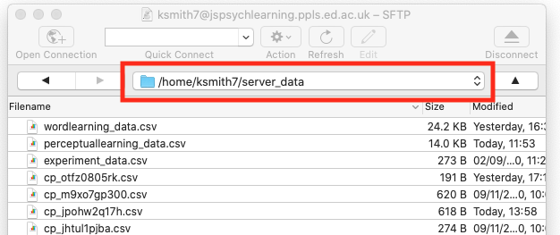

## The plan for week 8 practical

This week we are going to look at code for a confederate priming experiment based on the experiment described in Loy & Smith (2020) (and in fact using some of our stimuli). There's no new material to look at in the Online Experiments with jsPsych tutorial. As in the perceptual learning experiment we use the `audio-button-response` plugin to play audio and get button-click responses from a participant when they are listening to the confederate. We use `image-button-response` trials to have the participant look at an image, click a mic button to start recording audio, and then we call some behind-the-scenes functions that will record audio and save it to the server - you don't actually need to know how the audio recording code works, although the code is all commented up if you want to take a look. We are also going to add a few more bits and pieces involving randomisation (random participant IDs, random wait durations to simulate a human partner, random flipping of some image orientations), we'll build a custom preload list to make sure our button images are preloaded before the experiment starts (building on the answer to one of the harder questions from last week), and finally I'll show how to load a trial list from a CSV file (handy if you want to use a pre-built trial list).

Remember, as usual the idea is that you can work through these practicals in the lab classes and, if necessary, in your own time - I recommend you use the lab classes as dedicated time to focus on the practicals, with on-tap support from the teaching team.

## Acknowledgments

I cobbled together some audio recording code for the online experiments in Loy & Smith (2020); Annie Holz then jsPsych-ified it ([she has her own audio recording demo](https://experiments.ppls.ed.ac.uk/)), and I tweaked that code for this demo experiment.

For this demo experiment we are using audio stims produced by my RA Clem Ashton, who was the native English-speaking confederate in some experiments we ran (not actually those reported in the current draft of Loy & Smith, 2020, but some follow-ups). The images (which I love) were drawn by Jia Loy and are the ones we used in the experiments described in the paper.

## A confederate priming experiment

### Getting started

As usual, I'd like you to download and run the code I provide, look at how the code works, and then attempt the exercises below, which involve editing the code in simple ways.

You need a bunch of files for this experiment - as per last week, an html file, a js file, *two* php files (for saving CSV and audio data, and also reading in trial lists), various folders containing images, sounds, trial lists etc, plus additional files for a second version of the experiment. Again, rather than downloading them individually, download the following zip file and then uncompress it into your usual jspsych folder:
- <a href="code/confederate_priming.zip" download> Download confederate_priming.zip</a>

I also stuck a copy of jsPsych in the zip file, so it contains everything you need. As usual, extract it into your practicals folder or run it on the jspsychlearning server - since data (including audio) won't save if you run it locally, by this point you really want to be at least testing everything on the server. Furthermore, there are a couple of things to tweak before you can run the code:
- The code will save audio files to a subfolder of `server_data` called `audio` - so you need to create such a subfolder. You can create new folders in cyberduck quite easily, but you have to create this new folder in exactly the right way to make sure its permissions (rules about who can write to the folder) are set correctly, otherwise your audio won't save. Go to your `server_data` folder in cyberduck and go into the folder (i.e. double-click it) so your cyberduck window looks like this - note that my navigation bar shows me I am in `/home/ksmith7/server_data`, yours will show you as in `/home/UUN/server_data` depending on what your UUN is.

Then click the "action" button (with the cog), select the "New folder..." option and call the new folder `audio` (with that exact name, i.e. lower-case first letter). That should create a folder in the correct place with the correct permissions!
- You will need to use Chrome for the audio to work reliably. You will also have to change your Chrome settings to allow it to access the microphone. Quite sensibly, modern browsers have protections that prevent random websites accessing your microphone or camera in unsafe ways; the user always has to give permission, but also those resources are only available when the origin of the code (i.e. our server where the code lives) is secure, and can be trusted to be who it says it is. Our `jspsychlearning` server is not set up like that at the moment, it lacks the necessary certificates, so we have to tell Chrome to trust it for audio recording purposes - obviously you wouldn't ask real participants to do this step, you'd have to set up a secure server for your code, but in our case it's only us trying out the code and we know it's nothing dodgy, so we can use this work-around. The way to do this is as follow the following 4 steps (which I got from [here](https://medium.com/@Carmichaelize/enabling-the-microphone-camera-in-chrome-for-local-unsecure-origins-9c90c3149339)).
  - In chrome, copy this address into the navigation bar: chrome://flags/#unsafely-treat-insecure-origin-as-secure and go there.
  - Find and enable the `Insecure origins treated as secure` section.
  - Add http://jspsychlearning.ppls.ed.ac.uk to the text box of origins you want to treat as secure.
  - Save those settings if that is an option, then close that window and restart Chrome.

Once you have done those two preparatory steps you are ready to try out the experiment. There are actually two versions of the experiment included in the zip file:
- A short version with a small number of trials. The code for this is in `confederate_priming.html` and `confederate_priming.js`, and the URL will be http://jspsychlearning.ppls.ed.ac.uk/~UUN/online_experiments_practicals/confederate_priming/confederate_priming.html if your directory structure is as suggested in previous weeks. This is the code I will start with in the explanation below.
- A full-length version with a large number of trials (100+). The code for this is in `confederate_priming_readfromcsv.html` and `confederate_priming_readfromcsv.js`, and the URL should be http://jspsychlearning.ppls.ed.ac.uk/~UUN/online_experiments_practicals/confederate_priming/confederate_priming_readfromcsv.html. If you want a longer demo you can run this, but the main purpose of including the second version is to show you how a long trial list can be read in from a CSV file.

First, get the code and run through it so you can see what it does. If you have problems with getting the audio to record to the server, ask for our help! Then take a look at the HTML and js files in your code editor (starting with the simpler `confederate_priming.html` and `confederate_priming.js` version), and read on.

### Structure of the experiment

The experiment consists of two trial types, which alternate:
- Picture selection trials, where participants hear audio from their partner (in fact, pre-recorded audio from our confederate) and select the matching picture from an array of 4 pictures.
- Picture description trials, where participants see a picture and produce a description for their partner using a provided verb, clicking a mic icon to start and stop recording.

We are interested in whether, on critical trials featuring a ditransitive event,
the construction used in the description on the picture selection trial (PO or DO) influences the description the participant produces on the immediately following picture description trial.

Picture selection trials work in essentially the same was as picture selection trials in the perceptual learning experiment, using the `audio-button-response` plugin. Picture description trials are a series of `image-button-response` trials (with the participant clicking on a mic button to start and stop recording), with some additional infrastructure to handle recording audio. We also simulate the confederate preparing to speak and making a selection based on the participant's productions by inserting variable-duration "waiting for partner" screens.

The code therefore uses plugins you are already familiar with - the main new addition to the code is some functions which record audio, but you don't actually need to know how this works (although the code is there for you to look if you are interested).

### Loading the code for recording audio

Rather than putting all the audio recording code plus all the other experiment code in one long js file, I have split it - the audio recording code is in `confederate_priming_utilities.js`, which we load in our `confederate_priming.html` file at the same time as specifying the plugins etc we need and loading the `confederate_priming.js` file.

```html
<script src="confederate_priming_utilities.js"></script>
<script src="confederate_priming.js"></script>
```

The browser doesn't actually care if code is split over more than one file - it reads them in one after another, so variables and functions created in one file are accessible in code in another file. Splitting the code in this way makes for code that's easier to work with and also conceptually cleaner, in that you parcel off one set of functions (in this case, for recording audio) into its own file. That also makes it easy to reuse that code elsewhere - I have various experiments involving audio recording that all use essentially the same utilities file.

For our purposes all you have to know is that `confederate_priming_utilities.js` creates some variables and functions that we can use in our main experiment code. These are:

`recording_counter`, which is just a counter where we keep track of how many audio recordings we have made - the first recording is 0, the second 1 etc. We use these in the filenames of recordings and also in the CSV data saved on the server so that we can link particular recordings to particular experiment trials. jsPsych actually already creates a trial_index variable that we could use to keep track of this, but I found it very confusing if the first audio had index 11, the second had index 15 etc, so I set up this additional counter. 

`request_mic_access()`, which is a function which creates the various media and recorder objects we need to record audio, and will prompt the participant for mic access via a pop-up.

`start_recording(filename_prefix)`, which is a function that starts audio recording from the participants' mic. When the audio recording stops, the audio will be saved
to a file on the server (in `server_data/audio`) called filename_prefix_recording_counter.webm - e.g. if you pass in filename prefix "kennyaudio" the first recording will be saved as kennyaudio_0.webm.

`stop_recording()` is a function which stops the current audio recording, triggering saving of the audio file, and also increments the `recording_counter` so that the next recording has a different counter value and therefore a different file name.

### Random elements of the experiment

The first part of `confederate_priming.js` is comments on the audio recording code (for human reading, the code ignores these) and then some code for saving our data trial by trial - the function `save_confederate_priming_data` saves trial data in the same way as the `save_perceptual_learning_data` function from last week, and you'll see it used in the functions below. Since you have seen similar functions before, I'll skip these and jump to the new code, which starts with several functions for handling random elements of the experiment - there is a little bit of added complexity in there in that we want to record slightly different data for our two trial types, but you can look at the code and comments if you are interested.

First, we are going to assign each participant a random participant ID - this means we can save one CSV file and one set of audio recordings per participant, rather than cramming everything into a single file as we have been doing so far. We create these random IDs using a jsPsych built-in function:

```js
var participant_id = jsPsych.randomization.randomID(10);
```

This creates a variable, `participant_id`, which we can use later. The participant IDs are a string of randomly-generated letters and numbers, in this case set to length qo (e.g. "asqids6sn1") - since there are many many possible combinations of length 10 (36 to the power 10, which is more than 3,600,000,000,000,000) in practice this should mean that no two participants are assigned the same ID, and therefore each participant has a unique ID. Depending on how you set up your experiment, on some crowdsourcing platforms you might want to access the participant's platform-specific ID rather than generating a random one (e.g. every participant on Prolific has a unique ID), we'll show you how to do that in the final week of the course, it's easy. But for now we'll just generate a random ID per participant.

At various points in the experiment we also want to create a random-length delay, to simulate another participant composing their description or selecting an image based on the genuine participant's description. In the Loy & Smith (2020) paper we had a fairly intricate system for generating these random delays, making them quite long initially (to simulate a partner who was not yet used to the task) and then reducing over time (to simulate increasing familiarity, but also not to needlessly waste our real participants' time). My impression is that this was reasonably successful - not too many participants guessed they were interacting with a simulated partner - and also worth the effort, in that most of the people who *did* guess that they were not interacting with a real person were cued by their partner's response delays, in particular, noting that they were quite short and quite consistent.

In the demo experiment, for simplicity's sake we just create a function which returns a random delay between 1000ms and 3000ms, using some built-in javascript code for random number generation:

```js
function random_wait() {
  return 1000+(Math.floor(Math.random() * 2000))
}
```

`Math.random()` generates a random number between 0 and 1 (e.g 0.127521, 0.965341). We then multiply that by 2000 and use `Math.floor` to round down to a whole number (e.g. our random numbers will become 255, 1930 respectively), then add 1000ms to produce random waits in our desired range (e.g. 1255ms, 2930ms).

Finally, we need some code to randomly decide whether to include images in their default or reversed orientation. Participants will be describing events involving characters and objects, and we have good reasons to expect that the order in which characters appear in those scenes might influence the word order participants use (e.g. if people tend to process images left to right, and the recipient of a giving action is always on the left, maybe people will be likely to mention that recipient earlier in their description, introducing a bias for DO order). We therefore want to eliminate those kinds of systematic biases by presenting images in both possible orientations (e.g. recipient on the left or the right).

The `images` folder contains two versions of each image - the orientation that Jia drew them in, and then a reversed image where the image is flipped/mirrored on its horizontal axis. The two images have the same name except that the reversed image has "_r" added at the end - so for example, the two images below are `artist_gives_chef_hat.jpg` and `artist_gives_chef_hat_r.jpg`.


Our `random_image_flip` function will handle this for us - every time we want to include an image, we use `random_image_flip(image_name)`, which takes an image name and either returns that image name or the reversed version, by adding "" (i.e. nothing) or "_r" to the end of the image name. The random element is achieved by picking either "" or "_r" at random using `jsPsych.randomization.shuffle`.

```js
function random_image_flip(image_name) {
  var image_affixes = ["","_r"]
  var selected_affix = jsPsych.randomization.shuffle(image_affixes)[0]
  var new_image_name = image_name + selected_affix
  return new_image_name
}
```

### Picture selection trials

Now we are in a position to start coding up our main trial types. We'll start with picture selection trials, which work in a very similar way to picture selection trials in the perceptual learning experiment - participants hear some audio and then click on an image button. The only added complication here is that we want to simulate another person thinking for a moment before starting their description, which we will achieve by adding a "waiting for partner" message, on-screen for a random duration, followed by the audio and picture selection by the participant. Each picture selection trial therefore consists of two sub-trials: a random wait, then the picture selection. As usual, we'll write a function where we specify the main parts of the trial (the audio file the participant will hear, which I am calling `sound`; a list of images they will choose among, `images`) and then the function returns a complex trial object for us. Here's the full chunk of code, I'll walk you through it piece by piece below:  

```js
function make_picture_selection_trial(sound, images) {
  var sound_file = "sounds/" + sound + ".mp3";
  var image_choices = [];
  for (image of images) {
    image_choices.push(random_image_flip(image));
  }
  //simple waiting message
  var waiting_for_partner = {
    type: "html-button-response",
    stimulus: "Waiting for partner to speak",
    choices: [],
    trial_duration: function () {
      return random_wait();
    },
  };
  //audio trial
  var selection_trial = {
    type: "audio-button-response",
    stimulus: sound_file,
    choices: image_choices,
    button_html:
      '<button class="jspsych-btn"> </button>',
    post_trial_gap: 500, //a little pause after the participant makes their choice
    on_start: function (trial) {
      var shuffled_image_choices = jsPsych.randomization.shuffle(trial.choices);
      trial.choices = shuffled_image_choices;
      trial.data = { participant_task: "picture_selection",
                     button_choices: shuffled_image_choices };
    },
    on_finish: function (data) {
      var button_number = data.response;
      data.button_selected = data.button_choices[button_number];
      save_confederate_priming_data(data); //save the trial data
    },
  };
  var full_trial = { timeline: [waiting_for_partner, selection_trial] };
  return full_trial;
}

```

First, we need to do some book-keeping: adding the path for the sound file (all our sound files are in the `sounds` directory and have `.mp3` on the end)

```js
var sound_file = "sounds/" + sound + ".mp3";
```
and randomising the orientation in which the images will be presented by working through the `images` list with a for-loop, randomly flipping each image or not and building up our array of `image_choices`:

```js
var image_choices = [];
for (image of images) {
  image_choices.push(random_image_flip(image));
}
```

Our random wait is then a simple `html-button-response` trial, where there are is no button to respond with (`choices` is set to [], i.e. the participant can't end the trial prematurely) and with a random `trial_duration`.

```js
//simple waiting message
  var waiting_for_partner = {
    type: "html-button-response",
    stimulus: "Waiting for partner to speak",
    choices: [],
    trial_duration: function () {
      return random_wait();
    },
  };
```

Our actual selection trial requires quite a large block of code to generate it (see the big chunk of code above, where we create `selection_trial`), but this is all stuff you have seen before - an `audio-button-response trial`, where we randomise the button position `on_start`, and then work out which button the participant actually clicked `on_finish`, saving the trial data to the server using the `save_confederate_priming_data` function too. In the `on_start` we also add an extra parameter to the trial `data` object, simply marking these trials as picture selection trials:

```js
trial.data = { participant_task: "picture_selection",
...
```
This will just make our data file a little clearer.

Finally, we stick our waiting trial and our picture selection trial together as a single trial consisting of just a timeline and returning that two-part trial.:

```js
var full_trial = {timeline:[waiting_for_partner,selection_trial]};
return full_trial
```

### Picture description trials

Next we create our picture description trials - remember, for these the participant sees an image, clicks a button to start recording a description, clicks again to stop recording, and then "waits for their partner to make a picture selection" based on their description (in reality, the participant just gets a waiting message and waits for a random time). This can be achieved with a 3-part timeline: the initial part of the trial where the participant sees the image and clicks a button to start recording, then the second part where they speak and then click again to stop recording, then the random wait. The first two trial types are just `image-button-response` trials, and the random wait will again be an `html-button-response` trial with a random duration.

Again, we write a function which builds this complex trial for us - we pass in the target image to be described plus the verb to be used in the description, it returns the complex trial for us. The full code is:

```js
function make_picture_description_trial(target_image, verb) {
  var target_image_flipped = random_image_flip(target_image);
  var picture_plus_white_mic = {
    type: "image-button-response",
    stimulus: "images/" + target_image_flipped + ".jpg",
    stimulus_width: 500,
    prompt: verb,
    choices: ["mic"],
    button_html:
      '<button class="jspsych-btn" style="background-color: white;"> </button>',
  };
  var picture_plus_orange_mic = {
    type: "image-button-response",
    stimulus: "images/" + target_image_flipped + ".jpg",
    stimulus_width: 500,
    choices: ["mic"],
    prompt: verb,
    button_html:
      '<button class="jspsych-btn" style="background-color: Darkorange;"> </button>',
    on_start: function (trial) {
      trial.data = {participant_task: "picture_description"};
      start_recording(participant_id);
    },
    on_finish: function (data) {
      data.recording_counter = recording_counter;
      stop_recording();
      save_confederate_priming_data(data);
    },
  };
  var waiting_for_partner = {
    type: "html-button-response",
    stimulus: "Waiting for partner to select",
    choices: [],
    trial_duration: function () {
      return random_wait();
    },
    post_trial_gap: 500, //short pause after the confederate makes their selection
  }; 
  var full_trial = {
    timeline: [
      picture_plus_white_mic,
      picture_plus_orange_mic,
      waiting_for_partner,
    ],
  };
  return full_trial;
}
```

Let's step through that chunk by chunk. First we randomly flip the image so that not all images appear in the default orientation:

```js
var target_image_flipped = random_image_flip(target_image);
```

Next we have the first sub-trial where the participant sees the image plus a "start recording" button and clicks to begin recording. This is just an `image-button-response` trial:

```js
var picture_plus_white_mic = {type:'image-button-response',
                              stimulus:"images/"+target_image_flipped+".jpg",
                              stimulus_width: 500,
                              prompt:verb,
                              choices:['mic'],
                              button_html:'<button class="jspsych-btn" style="background-color: white;"> </button>'}
```

We set the size of the picture (I though 500 pixels wide was reasonable), and show the verb the participant should use in the `prompt` (it's not super-prominent, but it will do - you would want to write instructions which highlighted this verb text to the participants so they know what the prompt is doing). The participant's `choices` on this trial is just the mic button - we use the `mic` image file, which is in the `images` folder, and do a little bit of formatting in `button_html` so the mic image appears with a white background (which we'll change below to orange to indicate they are recording).

When the participant is ready they click the mic button, which progresses them to the next trial. This is where the action happens: we have to indicate they are recording (which we do by turning the mic button orange), actually start the recording, and then when they click the mic button again we have to stop the recording and save the trial data. The code for all that looks like this:

```js
var picture_plus_orange_mic = {
    type: "image-button-response",
    stimulus: "images/" + target_image_flipped + ".jpg",
    stimulus_width: 500,
    choices: ["mic"],
    prompt: verb,
    button_html:
      '<button class="jspsych-btn" style="background-color: Darkorange;"> </button>',
    on_start: function (trial) {
      trial.data = {participant_task: "picture_description"};
      start_recording(participant_id);
    },
    on_finish: function (data) {
      data.recording_counter = recording_counter;
      stop_recording();
      save_confederate_priming_data(data);
    },
  };
```

A bunch of stuff is the same as in the `picture_plus_white_mic` trial - the image, its size, the mic button, the verb prompt - so there is no big visual change for the participant. But a couple of things are different.

First, we change the background colour of the mic image to orange, so the participant can see their click had an effect and they are now recording. This is done in the `button_html` parameter, where we set the mic button background to dark orange.

```js
button_html:'<button class="jspsych-btn" style="background-color: Darkorange;"> </button>',
```

Next, the trial has an `on_start` function, where (as well as adding information to the trial data that this is a picture description trial) we use the `start_recording` function to start recording from the participant's mic. Remember, this function is defined in our `confederate_priming_utilities.js` file, and we specify the name of the file where we want the audio saved - here we are using the participant's ID (which we created earlier and stored in the variable `participant_id`), so that each participant's audio will be recorded in easily-identified and separate sets of files:

```js
on_start: function (trial) {
      ...
      start_recording(participant_id);
    },
```

Finally, when the participant is done talking they click the mic button again to stop recording - so in this trial's `on_finish` parameter (which runs when they click the mic button) we stop the recording using our `stop_recording()` function.

```js
on_finish: function(data) {
  ...
  stop_recording();
  ...
}
```
 We also want to save the data from this trial, which we do using `save_confederate_priming_data`. But when we do that, we want to keep a note of `recording_counter` (which is our internal counter of recording numbers), so that when it comes time to listen to the recordings we can link the audio recording files (which include `recording_counter` in their name) with the specific trial in the experiment. To do that, we make a note of `recording_counter` in our trial data (note that we do that *before* we stop the recording, because `stop_recording` increments `recording_counter` in preparation for the next recording), then save that data.

 ```js
 on_finish: function(data) {
 data.recording_counter = recording_counter
 ...
 save_confederate_priming_data(data)}
 ```

Finally, we add the third sub-trial, the waiting message with random duration, and then build and return a trial with a nested timeline featuring our three trials (white mic, orange mic, waiting message):

```js
var waiting_for_partner = {
  type: "html-button-response",
  stimulus: "Waiting for partner to select",
  choices: [],
  trial_duration: function () {
    return random_wait();
  },
  post_trial_gap: 500, //short pause after the confederate makes their selection
}; 
var full_trial = {
  timeline: [
    picture_plus_white_mic,
    picture_plus_orange_mic,
    waiting_for_partner,
  ],
};
return full_trial;
```

### Building the interaction timeline

Now we can use these functions to build our timeline. We'll start by building a set of interaction trials, which alternate picture selection and picture description trials, then add the usual instructions etc later. Here's a set of 8 trials - the critical trials are 3 and 4 (the confederate produces a PO description then the participant describes a ditransitive event) and 7 and 8 (the confederate produces a DO description then the participant describes a ditransitive event). Note that the audio files have quite complex names, these were based on a numbering system we used to keep different experiment versions and run numbers distinct.


```js
var interaction_trials = [
  //filler, participant is selecting
  make_picture_selection_trial("E1N_16_the_clown_buys_the_cake", [
    "clown_buys_cake",
    "artist_buys_cake",
    "clown_buys_vase",
    "artist_buys_vase",
  ]),
  //filler, participant is describing
  make_picture_description_trial("artist_waves", "waves"),
  //critical trial, participant is selecting
  make_picture_selection_trial(
    "E1N_16_the_cowboy_hands_the_cup_to_the_golfer",
    [
      "cowboy_hands_golfer_cup",
      "golfer_hands_cowboy_cake",
      "golfer_hands_cowboy_cup",
      "cowboy_hands_golfer_cake",
    ]
  ),
  //critical trial, participant is describing
  make_picture_description_trial("sailor_gives_wizard_apple", "gives"),
  //filler, participant is selecting
  make_picture_selection_trial(
    "E1N_16_the_wizard_loans_the_prisoner_the_apple",
    [
      "wizard_loans_prisoner_apple",
      "prisoner_loans_wizard_vase",
      "prisoner_loans_wizard_apple",
      "wizard_loans_prisoner_vase",
    ]
  ),
  //filler, participant is describing
  make_picture_description_trial("pirate_holds_cake", "holds"),
  //critical trial, participant is selecting
  make_picture_selection_trial(
    "E1N_16_the_sailor_offers_the_prisoner_the_cup",
    [
      "sailor_offers_prisoner_cup",
      "prisoner_offers_clown_cup",
      "clown_offers_prisoner_cup",
      "prisoner_offers_sailor_cup",
    ]
  ),
  //critical trial, participant is describing
  make_picture_description_trial("soldier_offers_clown_apple", "offers"),
];
```

We then combine `interaction_trials` with some information screens (including a detailed explanation for the participant on granting mic access) to produce the full experiment timeline.

### A custom preload list

As I mentioned in last week's practical, jsPsych's `preload` plugin will pre-load images and audio for certain trial types, which makes the experiment run more smoothly and ensures that images you think participants are seeing have actually been loaded and are displaying. In particular, the image in `image-button-response` trials and the audio in `audio-button-response` trials are preloaded automatically if you include a preload plugin and set `auto_preload: true`. However, that won't automatically preload images used as buttons in `audio-button-response` trials, which means our image buttons in picture selection trials will not be pre-loaded. Fortunately the `preload` plugin allows you to specify an additional list of images to be preloaded, which we will use to preload these button images - you will hopefully have had a go at this in last week's practical.

While we could manually code up a preload list, the most straightforward way to do this is to work through `interaction_trials` and figure out which images are going to be used as buttons in the experiment, then add those images to a `button_images_list` which we later preload. The information we want is actually quite deeply embedded in `interaction_trials` though:
- Each item in `interaction_trials` is a trial with a nested timeline.
- Of the sub-trials in those nested timelines, we only care about `audio-button-response` trials.
- For each of those trials, the information we need is in the `choices` parameter...
- ...but `choices` is itself a list of several images, all of which we need to preload.

We can deal with this with a nested for-loop (see also something similar in the model answer for last week's harder exercises). First we work through the full trial list, looking at each trial in turn:
```js
var button_images_list = [];
for (trial of interaction_trials) {
  ...
}
```

For each of those trials, we look at its timeline:
```js
var button_images_list = [];
for (trial of interaction_trials) {
  var trial_embedded_timeline = trial.timeline;
  ...
}
```

For each of the trials in that timeline, we check if it's an `audio-button-response` trial:
```js
var button_images_list = [];
for (trial of interaction_trials) {
  var trial_embedded_timeline = trial.timeline;
  for (subtrial of trial_embedded_timeline) {
    if (subtrial.type=='audio-button-response') {
      ...
    }
  }
}
```

If it is, we retrieve the trial `choices`:
```js
var button_images_list = [];
for (trial of interaction_trials) {
  var trial_embedded_timeline = trial.timeline;
  for (subtrial of trial_embedded_timeline) {
    if (subtrial.type=='audio-button-response') {
      var image_choices = subtrial.choices;
      ...
    }
  }
}
```

We work through those choices with yet another for loop:
```js
var button_images_list = [];
for (trial of interaction_trials) {
  var trial_embedded_timeline = trial.timeline;
  for (subtrial of trial_embedded_timeline) {
    if (subtrial.type=='audio-button-response') {
      var image_choices = subtrial.choices;
      for (image of image_choices) {
        ...
      }
    }
  }
}
```

And finally we add each of those choices to our building preload list using `push`, remembering to add info on the image path and file type. The final code to build the preload list therefore looks like this:

```js
var button_images_list = [];
for (trial of interaction_trials) {
  var trial_embedded_timeline = trial.timeline;
  for (subtrial of trial_embedded_timeline) {
    if (subtrial.type == "audio-button-response") {
      var image_choices = subtrial.choices;
      for (image of image_choices) {
        var full_image_name = "images/" + image + ".jpg";
        button_images_list.push(full_image_name);
      }
    }
  }
}
```

Then we can use that list in the `preload` plugin, passing it to the `images` parameter of that plugin as a list of additional images to preload.

```js
var preload = {
  type: "preload",
  auto_preload: true,
  images: button_images_list,
};
```


### Advanced: reading the trial list from a CSV file

That's probably enough for one week, so if you feel you have learned enough for today you can skim this section very fast and not worry about the details - we'll actually cover something similar next week, so you'll have two opportunities to see this technique. But if you can take a bit more, read on! You don't have to master the details of this stuff, but getting the rough idea of how you read a trial list from a CSV might be useful.

The code above, which is in `confederate_priming.html` and `confederate_priming.js`, is perfectly adequate, and by adding more trials to `interaction_trials` you could fully replicate the Loy & Smith (2020) online experiments. However, we actually built those experiments slightly differently. You might recall from the paper that we ran 3 lab experiments, then online experiments as a follow-up, where we used the recordings of the confederate from the lab experiments as the confederate audio in the online version. That meant we couldn't generate timelines from scratch for the online experiment, because we could only have trials where we had the appropriate audio recordings available. We decided the simplest way to do this was to use our data CSV files generated in the lab experiment as the basis for the trial lists in the online experiment - we took those data files and used them to build new trial lists. This ensured that our online experiments closely matched our lab experiments in terms of images described etc, which meant that we had all the audio we needed.

If you look in the `trial_lists` folder you downloaded as part of the zip file for this week, you'll see a couple of CSV files containing trial lists - one for an alternating confederate, and one for a confederate who only produces DO descriptions. We have many such files, but to keep it simple I'll only show you two! Each line of those CSV files describes a pair of trials: the name of the file where we saved the audio of a confederate description (in the "confederateSentence" column), the 4 images the participant chose between after hearing that description (in the "matcherArray" columns), then the image the participant was instructed to describe (in the "participantImage" columns) and the verb they were to use (in the "participantVerb" column). There's also a bunch of other information that we saved which is less relevant here.

We can therefore read in these CSV files and use them to build a jsPsych trial list which closely matches the experience of our lab participants and uses the confederate audio recordings we have available. That's what `confederate_priming_readfromcsv.html` and `confederate_priming_readfromcsv.js` do. Most of the code is the same as the basic `confederate_priming.js` code, but at the end you'll see some extra code for reading a CSV file into javascript and then converting it to a jsPsych trial list. The main function is `read_trials_and_prepare_timeline` - we specify  the file name for a trial list and it reads it, creates a timeline and then runs it. Then we can start the experiment by running something like:

```js
read_trials_and_prepare_timeline("alternating_ns_confederate.csv");
```

E.g. in this case, loading the alternating confederate trial list. But how does this code work?

Reading a trial list from a CSV file in this way is slightly complicated, for two reasons. One reason is that we have to convert the text in the CSV file into something we can work with in javascript, which takes some time (the code contains two functions which do this, `read_trial_list` and `build_timeline`). But the other reason is that javascript behaves quite differently to other programming languages you may have used, in that it tries to run the code *synchronously* where it can - in other words, it doesn't necessarily wait for one function to finish before it starts the next function running. This isn't really noticeable unless you try running one function that is quite slow to execute *and* you need to use the output from that function as the input to another function, which is exactly what happens when we read a CSV file from the server. You might think we could do something like:

```js
var trial_list = read_trial_list(triallist_filename)
var interaction_trials = build_timeline(trial_list);
```
where `read_trial_list` gets the data from the CSV and then `build_timeline` turns it into a trial list that we can work with. However, this won't work. Getting data from a CSV file on the server takes some time - only a fraction of a second, so it appears instantaneous to us, but for the computer this is very slow. Rather than wait for the `read_trial_list` call to finish before it starts the `build_timeline` function running, the web browser will therefore press on and try to run `build_timeline`, but that will fail because the `trial_list` object which `build_timeline` needs as input doesn't actually contain any data yet, because `read_trial_list` hasn't finished!

How can we get around this problem? There are various solutions, but I think the simplest one is to use the `async` and `await` functions in newer versions of javascript. This allows us to declare some functions as `async` (i.e. asynchronous), and then use `await` to tell the browser to wait for a certain operation to complete before moving on. This means we can wait until the CSV file has been successfully read before we try to process the resulting data.  

That's how the `read_trials_and_prepare_timeline` function works - the full code is below, but this consists of the following steps:
- Read in the trial list from the CSV file using the `read_trial_list` function - we will `await` this result because we can't proceed without it. To keep the code as simple as possible the `read_trial_list` function is defined in a separate javascript file, `read_from_csv.js` - if you look at `confederate_priming_readfromcsv.html` you'll see we are loading this additional javascript file along with our plugins. You don't have to look at `read_from_csv.js` unless you want to - it's fine if you treat the process of reading in the CSV file as a black box, and we'll actually use a slightly different technique next week.  
- Use that trial list to build the interaction trials using the `build_timeline` function, which basically reads the relevant columns from the CSV and uses the `make_picture_selection_trial` and `make_picture_description_trial` functions we created earlier to make jsPsych trials.
- Build our image button preload list, which is just the same process as before but wrapped up in a function called `build_button_image_preload`.
- Stick that interaction timeline together with the instruction trials to produce our full timeline.
- And then run the full timeline.

In code, these steps look like this:

```js
async function read_trials_and_prepare_timeline(triallist_filename) {
  var trial_list = await read_trial_list(triallist_filename);
  var interaction_trials = build_timeline(trial_list);
  var preload_trial = build_button_image_preload(interaction_trials);
  var full_timeline = [].concat(
    consent_screen,
    instruction_screen,
    audio_permission_instructions1,
    audio_permission_instructions2,
    preload_trial,
    write_headers,
    interaction_trials,
    final_screen
  );
  jsPsych.init({
    timeline: full_timeline,
    on_finish: function () {
      jsPsych.data.displayData("csv"); //and also dump *all* the data to screen
    },
  });
}
```

Being able to specify your trial list ahead of time and save it as a CSV file can be useful in general and is something we will use again next week.

## Exercises with the confederate priming experiment code

Attempt these problems.
- Run the basic `conferedate_priming.html` experiment and look at the CSV and audio data files it creates. Check you can access the audio, and that you can see how the audio and the trial list link up.
- Run it again and see where the data from the second run is stored - you may need to refresh your cyberduck window with the refresh button.
- The short trial list I built in `conferedate_priming.js` is for a confederate who uses both PO and DO descriptions. How would you change that trial list to model a DO-only confederate?
- Now try running the `conferedate_priming_readfromcsv.html` experiment - you don't have to work through the whole experiment, just a few trials! Again, check you can see your data on the server.
- For this version of the experiment, how do you switch from an alternating to DO-only confederate? (Hint: this involves changing the name of the file used by the `read_trials_and_prepare_timeline` function in the very last line of the code).
- Building on the previous question: how would you randomly allocate a participant to one of these two conditions, alternating vs DO confederate? (Hint: you could look at the `random_image_flip` function for inspiration).
- For either of these experiments, figure out how to disable image preloading for the button images and re-run the experiment. Can you see the difference? If it works smoothly, try running the experiment in Chrome in Incognito mode, which prevents your browser saving images etc for you. Can you see the difference now?
- [Harder, optional] Can you change the `random_wait` function so it generates longer waits early in the experiment and shorter waits later on?


## References

[Joy, J. E., & Smith, K. (2020). Syntactic adaptation depends on perceived linguistic knowledge: Native English speakers differentially adapt to native and non-native confederates in dialogue. https://doi.org/10.31234/osf.io/pu2qa.](https://doi.org/10.31234/osf.io/pu2qa)

## Re-use

All aspects of this work are licensed under a [Creative Commons Attribution 4.0 International License](http://creativecommons.org/licenses/by/4.0/).
