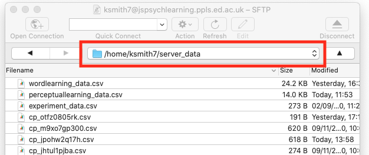
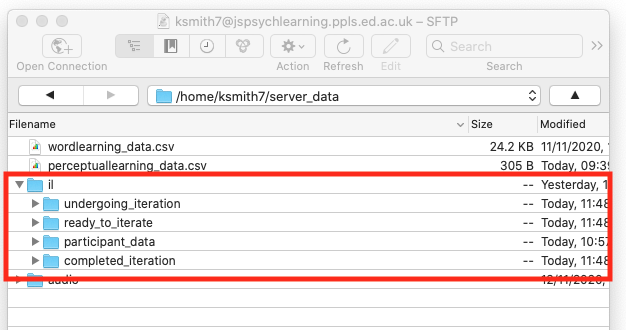
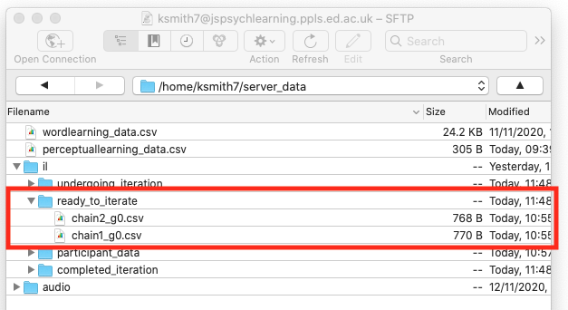

## The plan for week 9 practical

This week we are going to look at code for an iterated learning experiment, a simplified version of the experiment described in Beckner et al. (2017). There's no new material to look at in the Online Experiments with jsPsych tutorial, all the content is here.

In terms of the trial types we need to present to participants, this experiment is actually very simple, and uses elements of the code we developed in the practicals on word learning and perceptual learning.

- Participants go through an initial observation phase where they are exposed to objects paired with labels/descriptions. Again, this is basically identical to the observation phase of the word learning experiment in `word_learning.js`.
- In the final test, where participants try to reproduce the language they are trained on, on each trial participants are presented with an object and asked to produce a label/description for it. Beckner et al. used a free-typing production method, where people type stuff in. In some recent work with online iterated learning we (my RA Clem Ashton and I) switched to a more constrained production model:
participants are provided with a set of syllable options, and build complex labels by clicking on those syllable buttons. This reduces or removes the problem of participants typing English (e.g. "don't know", "no idea") or near-English versions of random labels (e.g. "vukano" -> "volcano"), which we were getting a lot of with free-typed responses on MTurk. We can achieve this by using the machinery for looping trials that jsPsych provides, looping a single `image-button-response` to allow a participant to click multiple times to build a label; in order to show that label on-screen where we want it, we'll actually use a customised version of `image-button-response` that has the prompt above the buttons rather than below. 

The complication this week is that rather than pre-specifying the language participants have to learn, we are running an *iterated learning* design: the language produced by one participant in the production phase becomes the input language to another participant in the observation phase, allowing us to pass the language from person to person and watch it evolve. Participants are organised in *chains*, where the participant at generation *n* in a particular chain learns from the language produced by the generation *n-1* participant in that chain.

There are a number of ways you could do iterated learning in an online experiment. You could write a python server, a bit like the one we will use for dyadic interaction next week, that keeps track of which chains are running, which participants are in which chains, and then passes over the appropriate training data when a new participant starts the experiment. Or you could run a database on the server (in another language, SQL, designed for managing databases), that does the same kind of thing, keeping track of which chains are open, which participants are in which chain, and so on.

Here we are going to go for a low-tech approach, using CSV files on the server to store the languages participants produce, and then using PHP scripts (just like the ones we use for saving data) to write to those files, read from those files, and move files around to different folders. This hopefully means that we can get an iterated learning experiment up and running without any extra fancy bells and whistles. We already looked at reading CSV files from the server to build a trial list (in the confederate priming code), so some of the principles involved here are the same (e.g. using asynchronous functions to make javascript wait while PHP is off reading a file from the server) and some are slightly different (in this experiment all the files we are manipulating will be in `server_data`, which necessitates a slightly different technical aproach). Again, like last week, I won't bother you with the contents of the technical infrastucture too much (the contents of the PHP scripts), and instead talk you through the code at a conceptual level, focussing on the jsPsych end of things.  

Remember, as usual the idea is that you can work through these practicals in the lab classes and, if necessary, in your own time - I recommend you use the lab classes as dedicated time to focus on the practicals, with on-tap support from the teaching team.

## Acknowledgments

The object stimuli for this week's experiment were provided by my colleague Dr Jennifer Culbertson, who uses slightly different variants of these images in several of her excellent papers on word order biases in noun phrase learning (e.g. [this paper in Cognition](https://doi.org/10.1016/j.cognition.2011.10.017)).

## An iterated learning experiment

### Getting started

**Important note:** This experiment requires a bit of careful set-up in your `server_data` folder on the jspsychlearning server, so don't just download it and start running it - read below for instructions on how to set everything up, otherwise the code will behave strangely and you'll be confused!

You need a bunch of files for this experiment - an html file, a couple of js files, some images, a bunch of php files and a copy of jsPsych as usual. Download the following zip file and then uncompress it into your usual jspsych folder:
- <a href="code/iterated_learning.zip" download> Download iterated_learning.zip</a>

This code won't work on your local computer, it needs to be on the jspsychlearning server - so once you have extracted the zip file, you need to upload the whole `iterated_learning` folder to your `public_html` folder on the jspsychlearning server, alongside your various other experiment folders.

Finally, we need to set up some stuff in your `server_data` folder. Managing this iterated learning experiment means we need to keep track of several things. First, we want to record participant data trial-by-trial as it comes in, just like we always do. But we also need to keep track of which chains are available to iterate, which chains are currently being worked on by a participant, and which generations of which chains are completed and don't need to be messed with any more. We are going to manage that stuff by moving files from folder to folder in `server_data`, so we need to set up those directories, and also drop in some starting languages to initialise our chains.

To do that, navigate into your `server_data` folder on cyberduck. You need to make sure that the folders you are creating inherit their access permissions etc from the main `server_data` folder, which you do by getting right into that folder on cyberduck before creating any new folders. Double-click the `server_data` folder so your navigation bar in cyberduck looks something like this (but with your UUN rather than mine obviously)


Once you are there, create a new folder (Action ... New folder in cyberduck) and call that folder `il` (short for iterated learning). Then double-click to enter the `il` folder, and create *four* new folders in there, called `ready_to_iterate`, `undergoing_iteration`, `completed_iteration` and `participant_data`. Here's what my server_data folder looks like after that step - you can see the `il` directory with the 4 sub-directories. Note that you have to get the folder names exactly right, otherwise the code won't be able to find the stuff it needs.



We are going to use `participant_data` folder to save our trial-by-trial data like we usually do; the other 3 folders will be used to keep track of the state of each iterated learning chain.

Finally, we need to make some initial (generation 0) languages available. If you look in the `iterated_learning` directory you got from the zip you downloaded, there's a sub-folder called `initial_languages_for_server_data`, containing two CSV files called `chain1_g0.csv` and `chain2_g0.csv`. Grab those and put them in the `ready_to_iterate` folder you just created in `server_data/il/` - these are random languages that will serve as the starting point for two iterated learning chains.

Once you've done that, your `server_data` folder looks like this, and you are ready to go!




### Managing an iterated learning experiment via PHP scripts

In an iterated learning experiment, one participant's output becomes the input for another participant. Participants are organised in chains, and you'll typically have several chains open at once ("open" means that you need to add more participants to those chains to get them to the desired number of generations). There are three main kinds of events you have to handle:
1. When a new participant starts the experiment, you have to allocate them to an open chain (or deal with them some other way if there are no chains open), and avoid allocating any other new participants to the same chain until they are finished (i.e. there's no point in having two participants both competing to be generation 3 of chain 2 or whatever).
2. When a participant completes the experiment, you need to make their output language available as the input language for the next participant in their chain.
3. If a participant drops out (which happens *a lot* online) you need to recycle the chain that was allocated to them, making it available to another participant.

As I mentioned above, there are a bunch of ways you could do this, but here I've gone for a relatively simple solution. We will store input languages as CSV files on the jspsychlearning server. Those input language files will contain a list of object-label pairs which we can easily read in to create training for a participant, or write out based on what a participant does during production testing. The file name will give the chain number and generation number - so for instance, the file `chain1_g0.csv` is the language of generation 0 (i.e. the initial language) for chain 1, and the top of that file looks like this:
```
object,label
images/o1_cB_n1.png,visivu
images/o1_cB_n2.png,kotisu
images/o1_cB_n3.png,vovaso
images/o2_cB_n1.png,kukati
```
You can see that this is a CSV (comma-separated) file with two columns; the object column is just the name of one of our stimulus images and the label column is a label for that object. Note that the image files have structured names too - the code doesn't care about that, but each image file specifies an object shape (o1, o2 or o3), a colour (cB, cG or cO for colour blue, green and orange respectively), and a number (n1, n2 or n3, for 1, 2 or 3 objects in the image).

Reading from and writing to these CSV files provides a simple way to pass a language from participant to participant - we read in the language from a CSV file to create training data, then when the participant completes the production phase we can write a new language file capturing their language, which can be read in by the next participant in the chain. You should already be familiar with the idea that we can write to CSV files using PHP - that's what we have been doing every time we save a participant's trial data. You have also seen one example of reading in a CSV and creating a trial list, in the confederate priming practical last week.

We also need a way to keep track of which chains are open, which are in progress etc. We'll do this by moving files among the various sub-directories you created in `server_data/il`.

Any files in the `ready_to_iterate` folder indicate chains that are ready to iterate - these are available to be allocated to a new participant who loads the experiment. Once we allocate a given generation of a given chain to a new participant (event 1 of the 3 events above), we move the input language CSV file to the `undergoing_iteration` folder - that stops it being allocated to anyone else while our participant is working on it.

If the participant completes the experiment (event 2 above) then we take their production output and write it as a new CSV file in `ready_to_iterate`, making it available for the next participant in the chain (and updating the generation number - e.g. if we train someone on the language in `chain1_g0.csv`, we write the language they produce to `chain1_g1.csv`). We also move their input language file out of `undergoing_iteration` and into `completed_iteration`. That's mainly to keep it nice and clear which generations of which chains are currently being worked on and which are complete - you can look at the various folders on `server_data/il/` and immediately see which chains are running, which are waiting for new participants, and which are done.

Finally, if our participant drops out (event 3 above), we just move the input language file they were working on back from `undergoing_iteration` to the `ready_to_iterate` folder - that makes it available again, and prevents drop-out participants clogging up our chains. Conveniently jsPsych provides a way of handling participant dropouts, allowing you to run a function to do stuff when the participant closes their browser window before completing the experiment.

All of these various actions are carried out by PHP scripts, which we can call from our jsPsych experiment. `list_input_languages.php` returns a list of files in the `ready_to_iterate` folder back to the jsPsych experiment, which we can use to figure out which chains are open and then pick a random chain for our new participant. `load_input_language.php` reads in a specific language file and sends it back to jsPsych in a usable format (note that this is slightly different from how we were reading in CSV files in the confederate priming code; now we are doing the reading in PHP, in the confederate priming code I was doing it in the javascript). We can use `save_data.php` to write participant's output languages (as well as saving participants' trial-by-trial data to the `participant_data` folder). And `move_input_language.php` handles the process of shuffling CSV files back and forth between our various directories. All the javascript code that interfaces with these PHP scripts is in a separate javascript file, `manage_language_files.js` - you can look at the details if you want, but you don't have to, you can treat that as a black box that just carries out a specific set of operations for you.

### Digging in to the code: updating our save_data function

Now you (hopefully) get the general idea, we can have a look at some more detailed aspects of the code. The first thing to flag up is that I have changed the `save_data.php` script a bit, and also changed the `save_data` function in the javascript code, to make it a bit more general. In the older version of our `save_data.php` it was hard-wired to write to the top-level `server_data` folder; for the new experiment we want to save stuff to two different sub-folders of `server-data/il` (saving participant data to `server-data/il/participant_data` and output languages to `server-data/il/ready_to_iterate`), and we really don't want to have to write two different PHP scripts which are trivially different from each other just to handle that.

The solution is to make the `save_data.php` and `save_data` javascript functions a bit more general - we pass in information about which directory to save the data in (which avoids us having to create different PHP scripts for saving in slightly different directories). The new more general code looks like this:

```js
function save_data(directory, filename, data) {
  var url = "save_data.php";
  var data_to_send = {
    directory: directory,
    filename: filename,
    filedata: data,
  };
  fetch(url, {
    method: "POST",
    body: JSON.stringify(data_to_send),
    headers: new Headers({
      "Content-Type": "application/json",
    }),
  });
}
```

In particular, we now pass more complex information over to the PHP script (in `data_to_send`) - not just the filename and data, but also the directory to save in. The other stuff implementational (the fetch command, the JSON stuff, etc) is the same as the old version you don't have to worry about those details.

Our `save_iterated_learning_data` function (which is the next bit in the code) then uses this new `save_data` function to save participant trial-by-trial data to the `participant_data` folder. But we'll also use the same `save_data` function to write final output languages to the `ready_for_iteration` folder too.

### Calling PHP scripts to do various things with input language files

There's a separate javascript file, `manage_language_files.js`, that sets out 4 functions which do all our manipulation of language CSV files for us. You need to know roughly what they do to understand the rest of the code, but you don;t have to know the details (unless you want to, in which case you can look at the code and comments in `manage_language_files.js`). The first two functions, `list_input_languages` and `read_input_language`, have the same structure - they use `fetch` to run a PHP script on the server, and then receive back a response from the PHP script, which they do a little formatting on (to turn the data into something we can work with). Because these functions interact with a PHP script which is reading data files on the server, we have to set them up as `async` (asynchronous) functions, and tell them to `await` the response from the PHP server before doing anything. I mentioned this async/await stuff briefly at the end of the confederate priming practical, but to recap: fetching data from the server via PHP takes some time - only a fraction of a second, so it appears instantaneous to us, but for the computer this is very slow. Rather than wait for the `fetch` command to finish, your browser tries to press on and run the rest of the code - if you are familiar with 'normal' programming languages like python, that run things one step at a time, this is a very weird behaviour that takes some time to get used to! In this particular case, trying to carry on while the `fetch` function goes off and does its job is a bad idea, since we actually need to get the response back from the PHP script before we can continue - running off ahead before the `fetch` returns the data we need will cause our code to break, because until the `fetch` command returns its data we can't actually process it!

There are various solutions to this problem, but I think the simplest one is to use the `async` and `await` functions (which are part of newer versions of javascript). This allows us to declare some functions as `async` (i.e. asynchronous, in other words there are some steps that involve waiting for one function to complete before proceeding, rather than running everything synchronously/simultaneously), and then use `await` to tell the browser to wait for a certain operation to complete before moving on. This means we can wait until the `fetch` command has done its job and got the data we need.

If we call `list_input_languages()` what eventually gets returned is a list of the CSV files in the `server_data/il/ready_to_iterate` folder. When we call `read_input_language(input_language_filename)`, we tell it specifically which CSV file to read from the `ready_to_iterate` folder and it eventually gives us back a nice javascript representation of the contents of the file, in the form of a list of javascript objects - so the first few rows of `chain1_g0.csv` I showed you above would be read in as:
```js
[
  {object:'images/o1_cB_n1.png',label:'visivu'},
{object:'images/o1_cB_n2.png',label:'kotisu'},
{object:'images/o1_cB_n3.png',label:'vovaso'},
{object:'images/o2_cB_n1.png',label:'kukati'}
]
```
We can then use this list of object-label pairs to build training and testing timelines.

The third function in that separate file, `move_input_language`, basically follows the same idea - we bundle up some info and ask a PHP script to do a job for us. `move_input_language(input_language_filename,from_folder,to_folder)` moves `input_language_filename` from `from_folder` to `to_folder`! Finally, `save_output_language(object_label_list)` is called when a participant completes the production phase, and we use it to save their set of object-label pairs (which we build during the production phase) to a new file in `server_data/il/ready_to_iterate`.

`object_label_list` is in the same format we end up with when we read in a language from an input language file, i.e. something like this:

```js
[
{object:'images/o1_cB_n1.png',label:'visivu'},
{object:'images/o1_cB_n2.png',label:'kotisu'},
{object:'images/o1_cB_n3.png',label:'vovaso'},
{object:'images/o2_cB_n1.png',label:'kukati'}
]
```


### Observation and production trials

As per usual, we need to define a function to build observation trials (where the participant sees a picture plus label) and production trials (the participant sees an image, produces a label). Observation trials are based on the code from the practical on word learning, so I won't go over it in detail here. We will take a look at production trials though, because there are a couple of things to note.

First, since we are providing participants with a limited set of syllables to build labels from, we need to list the syllables they can use.

```js
var available_syllables = jsPsych.randomization.shuffle([
  "ti",
  "ta",
  "to",
  "tu",
  "ki",
  "ka",
  "ko",
  "ku",
  "si",
  "sa",
  "so",
  "su",
  "vi",
  "va",
  "vo",
  "vu",
]);
```

Notice that I am shuffling the list of syllables once, at the point at which the experiment loads: this means that in production trials the syllables will appear appear on-screen in random order, but that order will be consistent throughout the experiment. Shuffling the syllables every trial would be an option, but that makes it very hard work for the participant, who has to hunt for the syllable they want in a different place on every trial.

Second, we need to keep track of the labels the participant produces as they  work through the production phase, so that if/when they complete the production phase, we can save their final language to use as input for another participant. We will store their building list of productions to `participant_final_label_set`, which is initially just an empty list.
```js
var participant_final_label_set = [];
```

Finally, we define a function, `make_production_trial`, which takes an `object_filename` (e.g. `images/o1_cG_n2.png`) and creates a production trial for that object. This is conceptually quite similar to the production trials in the word learning experiment earlier in the course - the participant sees an image and clicks on a label, so that provides a good starting point for thinking about how to build this kind of trial. The difference is that in the word learning experiment the participant only had to click once - here we need them to click several times, to build a label syllable by syllable. And we can't just pre-specify that they need to click e.g. 3 times to build a 3-syllable label - we want the participants to have the freedom to make the labels as short or long as they like. 

The solution is to have a trial that *loops* until the participant indicates they are done building the label, at which point we exit the loop and move on to the next trial. jsPsych provides some tools for looping - any trial can have a `loop_function` parameter that tells it if a trial should loop - but since this is slightly complicated I will build up the production trial step by step.

Here's where we could start, with a one-click production trial based closely on the production trial from our word learning experiment:

```js
function make_production_trial(object_filename) {
  
  //add the DELETE and DONE buttons to the syllables
  var buttons = available_syllables.concat(["DELETE", "DONE"]);

  //define what a single production trial looks like - this will loop
  var single_production_trial = {
    type: "image-button-response",
    stimulus: object_filename,
    stimulus_height: 150,
    choices: buttons,
    on_finish: function (data) {
      //figure out what button they clicked using buttons and data.response
      var button_pressed = buttons[data.response];
      data.label = button_pressed;
      data.block = "production"; //mark it as production data
      participant_final_label_set.push({object:object_filename,label:data.label}); //add this object-label pair to participant_final_label_set
      save_iterated_learning_data(data); //save the data (which will include the built label)
    }
  };
  return single_production_trial;
}
```
Hopefully that makes sense - it's just an `image-button-response` trial, the buttons the participant has available are `available_syllables` plus buttons labelled DELETE and DONE (which we will need later), and when the trial finishes we save the participant's data, both to their data file but also adding to `participant_final_label_set`, recording which label they produced for this object so we can record their final language for eventual iteration. 

This will work for a single-click trial but doesn't allow the participant to select multiple labels. To do that we need to loop. [You can read the jsPsych documentation on looping](https://www.jspsych.org/6.3/overview/timeline/#looping-timelines). The relevant part is at the top: "Any timeline can be looped using the `loop_function` option. The loop function should be a function that evaluates to true if the timeline should repeat, and false if the timeline should end." They also provide a very handy example, which is where I started when coding this myself. So we want our `single_production_trial` to loop until the participant clicks DONE. Following the example in the jsPsych documentation, we can achieve this by making a wrapper trial with a timeline consisting of `single_production_trial`, which decides to loop or not based on whether the participant just clicked DONE (in which case we want to stop looping) or not (in which case we can continue looping). That wrapper trial looks something like this:

```js
var production_loop = {
    timeline: [single_production_trial],
    loop_function: function () {
      //return true if we want to continue looping otherwise return false to stop looping
    },
  };
```

We can combine that together with our definition of `single_production_trial` to get close to what we want. The one thing we have to figure out is how to check whether the participant clicked DONE, and if so how to pass that information to the loop_function in the wrapper trial. There are several ways you could do this, but I decided to do it by creating a new variable, `continue_production_loop`, which is set to `true` at the start of the trial; then when the participant clicks a button, we check if that button was the DONE button; if it was we set `continue_production_loop` to `false`. Then our loop_function just uses `continue_production_loop` to decide whether to loop or not. The code for that looks like this:

```js
function make_production_trial(object_filename) {
  var continue_production_loop = true; //use this to control the production loop
  //add the DELETE and DONE buttons to the syllables
  var buttons = available_syllables.concat(["DELETE", "DONE"]);

  //define what a single production trial looks like - this will loop
  var single_production_trial = {
    type: "image-button-response",
    stimulus: object_filename,
    stimulus_height: 150,
    choices: buttons,
    //after the participant clicks, what happens depends on what they clicked
    on_finish: function (data) {
      //figure out what button they clicked using buttons and data.response
      var button_pressed = buttons[data.response];
      //if they clicked DONE
      if (button_pressed == "DONE") {
          var button_pressed = buttons[data.response];
          data.label = button_pressed;
          data.block = "production"; //mark it as production data
          participant_final_label_set.push({object:object_filename,label:data.label}); //add this object-label pair to participant_final_label_set
          save_iterated_learning_data(data); //save the data (which will include the built label)
          continue_production_loop = false; //break out of the loop
        }
    }
  };
  //slot single_production_trial into a loop
  var production_loop = {
    timeline: [single_production_trial],
    loop_function: function () {
      return continue_production_loop; //keep looping until continue_production_loop=false
    },
  };
  return production_loop;
}
```

So that will loop until the participant clicks DONE, at which point the trial will stop. That's pretty close to what we want, but there are a few problems:

1. We only record the *last* button the participant clicks (which will be DONE), rather than all the buttons they clicked until they clicked DONE. So we need to keep track of what they clicked as they built up their label, because that's what we are actually interested in.

2. We really don't want the participant to be able to click DONE until they have produced *something* - blank responses are no use to us, we want them to click at least one syllable.

3. We want the DELETE button to remove the last syllable they selected.

4. We want the participant to be able to see the label as they build it - otherwise it'd be very hard for them to see if the label they were building was what they intended.

We can solve all these problems by creating a new variable, `building_label`, which will be a list of all the syllables the participant has selected so far. Initially this will be empty:

```js
var building_label = []
```

But every time the participant clicks on a syllable, we will add that syllable to the building label using push - so if the participant clicks "ti" then "vu" the building label will be:
```js
["ti", "vu"]
```
To delete the last thing they clicked, we can use a built-in javascript function called `slice` to just chop the last item off the end of the list. And if we want to display the label as a single string rather than a list of syllables we can use another built-in function, `join`, which takes a list of strings and pastes them together - e.g. `["ti", "vu"].join("")` will produce the string "tivu".

All we need to do now is show that building label on the screen. We can do that using the `prompt` parameter - every time we start our `single_production_trial` loop, we can work out what the current `building_label` is and display it in the prompt (displaying a dummy whitespace prompt if there is nothing in the building label). And finally, when the participant clicks DONE we save the pasted-together building label as their complete response. The code for all that is as follows:

```js
function make_production_trial(object_filename) {
  var building_label = []; //store the syllables of the building label here
  var continue_production_loop = true; //use this to control the production loop
  //add the DELETE and DONE buttons to the syllables
  var buttons = available_syllables.concat(["DELETE", "DONE"]);

  //define what a single production trial looks like - this will loop
  var single_production_trial = {
    type: "image-button-response",
    stimulus: object_filename,
    stimulus_height: 150,
    choices: buttons,
    //show the building label in the prompt
    prompt: function () {
      //if the building label is empty, dummy prompt
      if (building_label.length == 0) {
        return "&nbsp;";
      }
      //otherwise, paste together the syllables in building_label into a single word using join
      else {
        return building_label.join("");
      }
    },
    //after the participant clicks, what happens depends on what they clicked
    on_finish: function (data) {
      //figure out what button they clicked using buttons and data.response
      var button_pressed = buttons[data.response];
      //if they clicked DONE
      if (button_pressed == "DONE") {
        //only end the loop if they have produced *something*
        if (building_label.length > 0) {
          var final_label = building_label.join("");
          data.label = final_label;
          data.block = "production"; //mark it as production data
          participant_final_label_set.push({object:object_filename,label:final_label}) //add this object-label pair to participant_final_label_set
          save_iterated_learning_data(data); //save the data (which will include the built label)
          continue_production_loop = false; //break out of the loop
        }
      }
      //if they clicked DELETE, just delete the last syllable from building_label
      //which can be done using slice
      else if (button_pressed == "DELETE") {
        building_label = building_label.slice(0, -1);
      }
      //otherwise they must have clicked a syllable button, so just add that
      //to the building label
      else {
        building_label.push(button_pressed);
      }
    },
  };
  //slot single_production_trial into a loop
  var production_loop = {
    timeline: [single_production_trial],
    loop_function: function () {
      return continue_production_loop; //keep looping until continue_production_loop=false
    },
  };
  return production_loop;
}
```

That is a complicated trial! But hopefully you can see how it's built up from simpler stuff you have already seen, plus the new loop functionality. 

Note that at the end of the final trial (in `on_finish`, when the participant has clicked DONE) we do three things. First, we stick together the sequence of choices from `building_label` to form their final well-formatted label:
```js
var final_label = building_label.join("");
```

Second, we add a representation of the object-label pair the participant produced to `participant_final_label_set`:
```js
participant_final_label_set.push({object:object_filename,label:final_label}); 
```
Third, we also save the trial data to the server as usual, using `save_iterated_learning_data`, to keep a more detailed record of the participant's response.

The only annoying thing about this is that the `prompt` in the `image-button-response` plugin appears below the buttons, which looks terrible in this case, so we use a custom plugin, `image-button-response-promptabovebuttons`, which just repositions the prompt - we just load that custom plugin in the usual way, and use it instead of `image-button-response` here.

We can then use this `make_production_trial` function (and the equivalent `make_observation_trial` function) to create a trial list of observation and production trials. That's what the next block of code does: `build_training_timeline` and `build_testing_timeline` both take an input language specified as a list of ``{object:object_filename,label:a_label}`` object-label pairs, and build a training or testing timeline.

`build_training_timeline` takes a list of object-label pairs and builds a training timeline consisting of `n_repetitions` blocks (`n_repetitions` is set to 1 below, so only one repetition of each training item) - each block contains one observation trial for each object-label pair in `object_label_pairs`.
```js
function build_training_timeline(object_label_pairs, n_repetitions) {
  var training_timeline = []; //build up our training timeline here
  //this for-loop works through the n_repetitions blocks
  for (i = 0; i < n_repetitions; i++) {
    //randomise order of presentation in each block
    var shuffled_object_label_pairs =
      jsPsych.randomization.shuffle(object_label_pairs);
    //in each block, present each object-label pair once
    for (object_label_pair of shuffled_object_label_pairs) {
      var trial = make_observation_trial(
        object_label_pair.object,
        object_label_pair.label
      );
      training_timeline.push(trial);
    }
  }
  return training_timeline;
}
```

`build_testing_timeline` takes a list of object-label pairs and builds a testing timeline with one production trial for each object in `object_label_pairs`, in random order. Note that the labels are simply discarded here - to create a production trial we just need the object filename.
```js
function build_testing_timeline(object_label_pairs) {
  var testing_timeline = [];
  var shuffled_object_label_pairs =
    jsPsych.randomization.shuffle(object_label_pairs);
  for (object_label_pair of shuffled_object_label_pairs) {
    var trial = make_production_trial(object_label_pair.object);
    testing_timeline.push(trial);
  }
  return testing_timeline;
}
```

### Putting it all together

Finally we are in a position to put all of these functions together. The function `run_experiment()`, code below, runs through a 9-step process of looking for open chains, selecting an input filename to iterate from, building timelines and running the experiment, then saving an output language for the next generation to iterate from. The 9 steps are:

1. We see if there are any input languages available for iteration. If not, we
just tell the participant to come back later. If there at least one input language available, we proceed.
2. We select a random input language to use. The name of this file tells us what
chain and generation we are running (e.g. if the filename is chain10_g7.csv we know we are running generation 7 of chain 10), so we can extract that info from the filename (extracting this info from the filename is a little bit fiddly).
3. We read in the input language from the appropriate file.
4. We use that input language to generate training trials for this participant. We impose a *bottleneck* on transmission by taking a subset of the language of the previous generation (here, 14 randomly-selected object-label pairs) and using that to build the training timeline (here, repeating each of those object-label pairs once).
5. We also use that input language to build a testing timeline, requiring the participant to do a production trial for all possible objects (i.e. not just the 14 we selected for training - they have to generalise).
6. We build the full experiment timeline, combining the training and testing timelines with the various information screens which we defined earlier (I skipped the information trials in the code walkthrough, they are just the usual `html-button-response` trials), a trial to write headers to our data CSV file, and a preload trial.
7. We move the input language file we are using from `server_data/il/ready_to_iterate` to `server_data/il/undergoing_iteration`, so that another participant doesn't also start working on this input language.
8. We run the timeline
9. a. If the participant completes the experiment (i.e. gets to the end of the production phase), we save the language they produced during production as a new input language in `server_data/il/ready_to_iterate` and also move the input language they were trained on to `server_data/il/completed_iteration`, so that we know it's been done.
9. b. If the participant abandons the experiment we need to recycle their input language - they haven't completed the experiment, so we need someone else to run this generation of this chain. We simply move the input language file they were working on back to the `server_data/il/ready_to_iterate` folder. Note that you can capture this kind of exit event in jsPsych using the `on_close` parameter of `jsPsych.init`. **NB Some people find that his method for recycling input languages is a bit unreliable** - sometimes it works, sometimes it doesn't. This might be an issue with `on_close` (to be honest I'm a bit surprised it's possible to run functions in a browser window the user is trying to close!), or maybe my implementation of the code to move files around. Anyway, if you notice when testing that files are getting stuck in `ready_to_iterate` then you can manually move them using cyberduck. If you are planning on using this code to run a real iterated learning experiment with real participants, and can't find a way to make this 100% reliable, you'd need to have some kind of clean-up procedure where you check for files that are stuck in `undergoing_iteration`. 

Here's the code with those 9 steps marked up in the comments. In various places we need to know what chain and generation we are running (e.g. for saving the participant's final language to a file with the correct name) - we store this info in two variables, `chain` and `generation`, which we update once we allocate the participant to a specific chain. Note that in some places we also need to `await` the response from a PHP script that's retrieving some info from the server from us.
```js

var chain;
var generation;

async function run_experiment() {
  //1. We see if there are any input languages available for iteration
  var available_input_languages = await list_input_languages();
  //...If not, we just tell the participant to come back later (using the cannot_iterate_info html-keyboard-response trial created above)
  if ((await available_input_languages.length) == 0) {
    jsPsych.init({ timeline: [cannot_iterate_info] });
  }
  //...If there is, we proceed.
  else {
    //2. We select a random input language to use.
    var input_language_filename = jsPsych.randomization.shuffle(
      available_input_languages
    )[0];
    //...The name of this file tells us what chain and generation we are running
    //To retrieve generation and chain info from filename, split the filename at _ and .
    var split_filename = input_language_filename.split(/_|\./);
    //chainX will be the first item in split_filename, just need to lop off the 'chain' prefix and convert to integer
    chain = parseInt(split_filename[0].substring(5));
    //gY will be the second item in split_filename, ust need to lop off the 'g' prefix and convert to integer
    var input_generation = parseInt(split_filename[1].substring(1));
    //*This* generation will be the input language generation + 1
    generation = input_generation + 1;

    // 3. We read in the input language from the appropriate file.
    var input_language = await read_input_language(input_language_filename);

    // 4. We use that input language to generate training trials for this participant.
    // We impose a bottleneck on transmission by taking a subset of the language
    // of the previous generation (here, 14 randomly-selected object-label pairs)
    // and using that to build the training timeline (here, repeating each of those
    // object-label pairs once)
    var training_object_label_pairs =
      jsPsych.randomization.sampleWithoutReplacement(input_language, 14);
    // Note just 1 repetition of each label in training, just to keep the experiment duration down for you!
    var training_timeline = build_training_timeline(
      training_object_label_pairs,
      1
    );

    

    // 5. We use that input language to build a testing timeline, requiring the participant
    // to do a production trial for each object.
    var testing_timeline = build_testing_timeline(input_language);

    // NB I am creating a tidy-up trial, to run when the participant completes the production
    // phase, at this point, so it looks out of sequence! I could have done this in the
    // on_close of the last production trial, but it seemed simpler to do it as a
    // stand-alone event in the timeline, using the call-function trial type.
    // 9. If the participant completes the experiment (i.e. gets to the end of the production
    // phase), we save the language they produced during production as a new input language
    // in server_data/il/ready_to_iterate and also move the input language they were trained on to
    // server_data/il/completed_iteration, so that we know it's been done.
    var tidy_up_trial = {
      type: "call-function",
      func: function () {
        save_output_language(participant_final_label_set);
        move_input_language(
          input_language_filename,
          "undergoing_iteration",
          "completed_iteration"
        );
      },
    };

    // 6. We build the full experiment timeline, combining the training and testing timelines
    // with the various information screens.
    var full_timeline = [].concat(
      consent_screen,
      preload_trial,
      write_headers,
      instruction_screen_observation,
      training_timeline,
      instruction_screen_testing,
      testing_timeline,
      tidy_up_trial,
      final_screen
    );
    // 7. We move the input language file we are using from server_data/il/ready_to_iterate to
    // server_data/il/undergoing_iteration, so that another participant doesn't
    // also start working on this input language.
    move_input_language(
      input_language_filename,
      "ready_to_iterate",
      "undergoing_iteration"
    );

    // 8. We run the timeline
    jsPsych.init({
      timeline: full_timeline,
      // 9b. If the participant abandons the experiment we need to recycle their input language -
      // they haven't completed the experiment, so we need someone else to run this generation
      // of this chain. We simply move the input language file they were working on back to the
      // server_data/il/ready_to_iterate folder. Note that you can capture this kind of exit event
      // in jsPsych using the on_close parameter of jsPsych.init.
      on_close: function () {
        move_input_language(
          input_language_filename,
          "undergoing_iteration",
          "ready_to_iterate"
        );
      },
      on_finish: function () {
        jsPsych.data.displayData("csv");
      },
    });
  }
}

```

An additional thing to note about this code: I have not implemented the deduplication filter - I figured the code was complicated enough! If you want to implement this (it's an optional and challenging exercise this week) you will need two extra steps:
1. Before implementing step 9a, saving the participant's produced language to the `ready_to_iterate` folder, you need to check it is usable, i.e. contains enough distinct labels. If so, you proceed as normal; if not, you recycle their input language (in the same way as if they had abandoned) and try again.
2. On step 4, selecting object-label pairs to use for training, you would need to select in a way that avoids duplicate labels, rather than selecting randomly.

Also note that there is no maximum generation number in this code - chains will
run forever! If you want to stop at e.g. 10 generations, this could also be implemented in step 9a - check this participant's generation number, if they are at generation 10 then don't save their lexicon to the ready_to_iterate folder.

The final line of the code simply runs this `run_experiment()` function, starting the whole 9-step process described above.

## Exercises with the iterated learning experiment code

- **After setting up the various folders in `server_data`**, run the experiment and use cyberduck to watch the CSV files appearing and moving around in `server_data/il` - remember you will need to click refresh in cyberduck regularly to see what's happening. Experiment with abandoning the experiment part-way through (i.e. closing the browser window) and see what happens. Look at the CSV data files that get created in various places, and check that the contents of the data files make sense and how they relate to what you see as a participant. Try to run a few generations of at least one chain and check that the iteration process works as you expect.
- How would you increase the number of training trials in the observation phase of the experiment to provide e.g. 6 passes through the training set? How would you increase or decrease the size of the transmission bottleneck?
- How would you randomise the order of the syllables on production trials separately for every production trial? Do you think that is better or worse? How about if you don't randomise them at all? Have a think about the possible consequences of these various randomisation choices.
- [Harder, optional] How could you insert a small number of test trials after each block of training trials, to keep the participant focussed on the task?
- [Harder, optional] Can you add a maximum generation number, so no chain goes beyond e.g. 10 generations?
- [Very hard, very optional] Can you implement a deduplication filter like that used by Beckner et al., to avoid presenting participants with ambiguous duplicate labels (where two distinct visual stims map to the same label)?

## References

[Beckner, C., Pierrehumbert, J., & Hay, J. (2017). The emergence of linguistic structure in an online iterated learning task. *Journal of Language Evolution, 2*, 160–176.](https://doi.org/10.1093/jole/lzx001)

## Re-use

All aspects of this work are licensed under a [Creative Commons Attribution 4.0 International License](http://creativecommons.org/licenses/by/4.0/).
