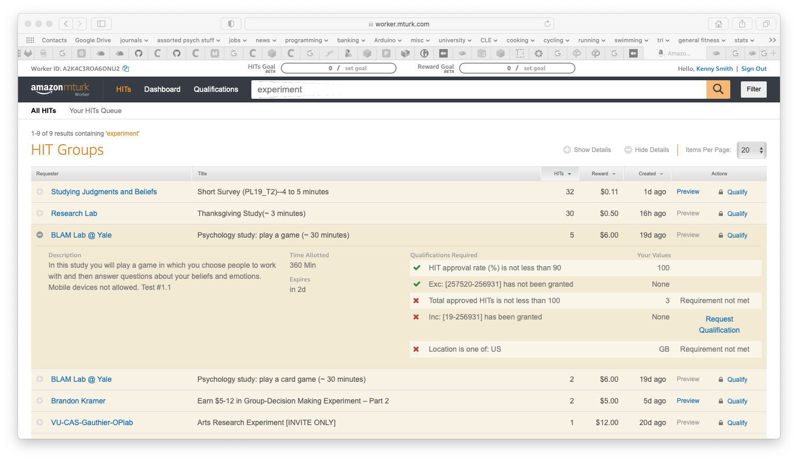
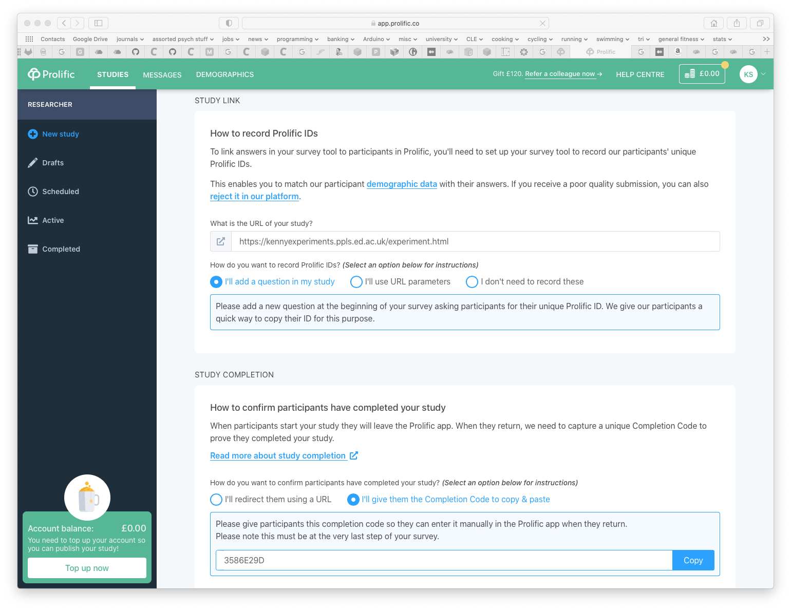
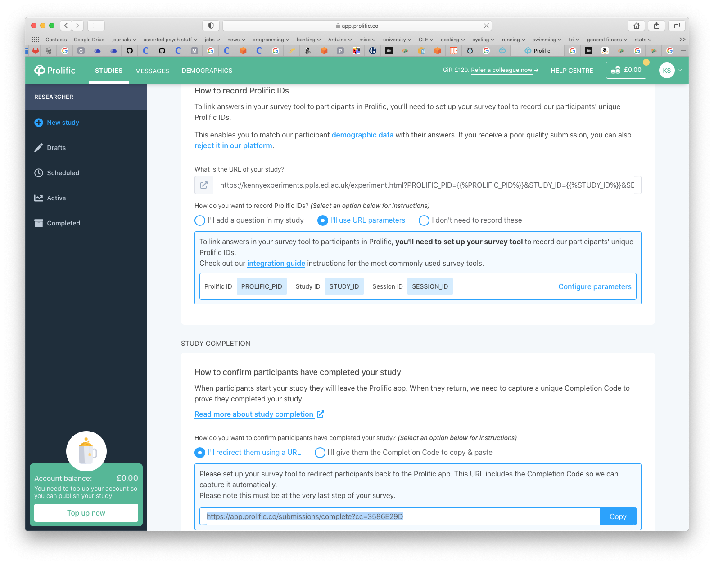

## The plan for week 11

We are basically done with the course - by this point you have read a bunch of papers using online data collection, and had the opportunity to play with jsPsych demo experiments to give you a feeling for how those experiments look under the hood (plus, hopefully, some code building blocks to get you started building your own experiments). But there are a number of other steps you have to go through to make your experiment available on the open web and start collecting actual data. In this document I will talk you through those steps, and also give some advice based on my experience of running stuff online.

**Important note:** We are not doing actual data collection as part of this course, so you do not have to go through any of these steps for the course assessments. The closest we get is building an experiment for assignment 2, but you should *not* collect any data - we haven't gone through the School ethics process, which is an essential check that you must always complete before collecting data.


## Getting your experiment online

Once you have built your experiment and tested that it delivers the stimuli you think it does in the way you want, records the responses you want, and seems reasonably robust to participants clicking in unexpected ways and mashing the keyboard, you will want to put it out into the wild and collect some real data. Before you can do that, there are a number of steps you need to go through:

1. Make sure your instructions are participant-friendly.
2. Get ethical approval!
3. Get a server to host your experiment.
4. Set up an account with a crowdsourcing site (e.g. MTurk, Prolific).
5. Put your experiment on that site, and handle participant payment.

I'll step through each of these in turn.

## 1. Make sure your instructions are participant-friendly

People need to understand what they are supposed to be doing in your experiment. One part of that is providing proper pre-experiment information (e.g. telling them roughly what they'll be doing, how long it will take, and how they will be paid) so they can provide informed consent. The other part is good step-by-step instructions on how to complete your task.

Writing good instructions is actually quite tricky, which is why I've been quite lazy for the demo experiments here and just put in placeholder information and instruction screens. You need to be relatively concise - if you give participants a wall of text they are less likely to read it. And you need to avoid inappropriate technical vocabulary - in most cases our target participants are probably not linguists or psychologists, so you need to think carefully about terms that are familiar to you but confusing for them. But you still need to give participants a good sense of what's expected - what will happen on a trial, what am I as a participant supposed to do, and is there some criterion I have to meet to be allowed to continue, e.g. a minimal accuracy rate or something like that? Getting other people's input on your instructions (e.g. getting a friend or colleague to look them over) can really help in ironing out any unclear bits or missing steps - what's obvious to you may not be obvious to a naive reader. I think images in instructions are always really helpful too - rather than saying "you will see two images and must click a button below the image with with the red square", a screenshot with text annotations ("you see two images", "here's the red square", "you should click this button") will make it crystal clear and avoid the wall-of-text that people skip over.

As part of the same process it's also worth sanitising your experiment more generally, so that you are not exposing information you don't want participants to see. Make sure the experiment title is participant-friendly: all the demo experiments on this course have titles (set in the HTML file) that are things like "iterated learning experiment" - unless you want to draw your participants' attention to the fact that it's an iterated learning experiment and have them wonder what that means, it might be better to change it to something more neutral, e.g. "language learning experiment". You might also find that in the course of building and debugging your experiment you end up with a bunch of stuff being logged in the console - participants can open the console too, so don't include anything in there that you don't want them to see.

## 2. Get ethical approval!

**You cannot collect data from human participants without going through a process for obtaining ethical approval**. In PPLS this involves submitting an application explaining the purpose of the experiment, who the participants are, what they will be paid, what kind of data will be collected, who will have access to their data, etc etc; you also provide the information sheets/screens that participants see in order to provide informed consent. This process is obviously crucial - it protects potential participants and their data, but the additional layer of scrutiny can be very useful in helping you spot problems with your participant information materials, data management plans and things like that.

## 3. Get a server to host your experiment

We have been running stuff on `jspsychlearning.ppls.ed.ac.uk`, but that server isn't suitable for real data collection - apart from anything else, once we finish this course they will lock it down so that you have to be on the University network to access it, which your participants probably won't be. You therefore need an externally accessible server, that is reliable (i.e. won't fall over at random times when you are trying to collect data, generating emails from irate participants) and that has the technical features you need (e.g. PHP for saving data, a security certificate if you want to record audio, python and web sockets if you are doing something with dyadic interaction). There are several options you can look at.

### Edinburgh University hosting

The University provides free [web hosting](https://www.ed.ac.uk/information-services/computing/audio-visual-multi-media/web-hosting/hosting-service-options) that is suitable for our purposes in most cases - there are different levels of service, but they all support a webpage (with html, javascript), PHP on the back-end (for recording data etc), and a security certificate (your webpage will be reached via https rather than plain http) so the audio recording stuff we covered in the confederate priming practical will work without any messing about with Chrome settings. You request that one of these servers be set up and you'll get to pick your own domain name (e.g. it could be something like https://kennyexperiments.ppls.ed.ac.uk); they send you login details and you should be able to connect via cyberduck just like we did on jspsychlearning, or you can use a browser-based tool they provide called cPanel (looks a bit like cyberduck, runs in a web browser, allows you to upload files etc). The only thing this *can't* do is websockets, which we used for dyadic interaction; the settings on the Uni-hosted sites are standardised and quite tightly locked down for security.

### PPLS hosting  

PPLS also do some web-hosting, for stuff that can't be handled under the central University hosting - the jspsychlearning server is run by our PPLS technical people, but they also run other servers which are available on the open web (e.g. I run my stuff on a server called blake4). If you need something fancy (e.g. websockets for a dyadic interaction experiment) then you can request an account on one of our PPLS-hosted servers; because it's administered by our people they have a bit more flexibility in terms of what they can set up on the server for you.

### Other hosting options aimed at jsPsych users

Obviously increasing numbers of people want to make web experiments available online, and not everyone has access to the hosting options Edinburgh University provides. There are therefore several services you can use, either for a fee or for free, that will allow you to make an experiment available online without getting fully involved in the challenges of setting up your own server. The jsPsych documentation on github [provides some options](https://www.jspsych.org/6.3/overview/running-experiments/#hosting-the-experiment-and-saving-the-data). Of those, [Cognition.run](https://www.cognition.run) and [Pavlovia](https://pavlovia.org) look like nice options if you aren't trying to do anything too fancy; [Psiturk](http://psiturk.org) and [Pushkin](https://languagelearninglab.gitbook.io/pushkin/) look more powerful but also more complex, and the set-up looks substantially more challenging (and with relatively sparse documentation, although I have only skimmed it).

[Cognition.run](https://www.cognition.run) is free and designed to work with jsPsych - you create a task (an experiment), drop some jsPsych code into a web-based editor and it wraps that in an html page and gives you a public URL that participants can go to; it also saves data automatically to a CSV file that you can download from the task control panel. It looks *very* easy to use: basically you can take the contents of one of our .js experiment files, drop it into the "Task code" window, upload any images you need under the Stimuli link, and it will hopefully work. There are some downsides though. The first downside is that it looks like anything we try to do with PHP will fail, which means no PHP scripts for recording audio or iterated learning (and obviously no python server for dyadic interaction, which is a whole other set of technology). "How do I save data if I can't use PHP?" you might ask - well, it saves the data for you, I can't see what the underlying mechanism is but it looks like it saves in real time, i.e. trial by trial, which is nice. *But* it's the full undigested jsPsych data that gets saved (i.e. all the columns for all the trials, including instruction screens etc, with no option for specificity), so you'll have to hack out the data you want at the end. Second downside, using custom plugins might be a problem - it actually auto-loads any plugins you are using (which is clever), there is an option to upload external javascript files but I haven't tested whether it works with custom plug-ins. Third downside, it's a free service, and it's actually not entirely clear from the webpage who set it up, why, or how long they plan to maintain it; I wouldn't count on it being around forever and not degrading. Final downside, and this is an important one: you don't know exactly where the data is being stored or who has access (although [the info here](https://www.cognition.run/privacy) is reassuring), which will need to be covered in your ethics application (and I think would preclude storing any kind of sensitive or personal data).

[Pavlovia](https://pavlovia.org) looks like the same sort of idea: you upload your jsPsych code, they give you a URL for your experiment, and there's a bunch of back-end stuff going on to save your data. Pavlovia requires a paid account and you eat up credits every time someone runs the experiment (looks like £0.20 per participant). Many of the downsides are the same as for Cognition.run: no PHP as far as I can tell; only saves the default data *and* it looks like it saves once at the end of the experiment, not trial by trial; slight uncertainty about who has access to the data your participants generate). It also has some extra downsides: a per-participant charge, saving data only at the end, the interface for loading your experiment involves going through github which is an extra thing to figure out. The considerable upside is that Pavlovia is run by the people behind PsychoPy (a python library for behavioural experiments), they are based at Nottingham and now funded by the Welcome Trust, plus a bunch of UK Universities have Pavlovia subscriptions, so that plus that fact that it's pay-to-play makes me think it's likely to be around and maintained for a good while. If you are interested in checking out Pavlovia, go to the site, click on "Explore", filter the list of experiments that comes up so that you can only see jsPsych experiments, and then look at the source code for e.g. the simple reaction time experiment - you can see behind the scenes that it's a fairly familiar jsPsych experiment (the javascript code for this example is all in `index.html`, inside a `<script> ...</script>` tag, rather than being in a separate .js file), but there are two extra trials in the timeline using a new plugin type called `pavlovia` which connects and then disconnects the experiment from the Pavlovia interface (presumably for data collection).

### Commercial hosting

Another option is to use a commercial company who can host your website. The  challenge is that we need something a bit more than what's called "static website", where you can just put html and js files that people can load into their browsers - we also need to be able to run PHP scripts, which involves the host server actually running our PHP scripts to carry out simple computations.

**This section is in progress - I am working out if there is a relatively pain-free way to do this through e.g. Amazon Web Services or [Cloudways](https://www.cloudways.com/)**

### 4. Set up an account with a crowdsourcing site (e.g. MTurk, Prolific)

Once you have your hosting set up, you have a URL for your experiment that you can direct your participants to - the next step is to get that link to your participants. If you are recruiting e.g. from friends or on social media then you are basically done - you send your participants the URL, they go to it and do the experiment. But if you are planning to make your experiment available on a crowdsourcing site, you'll need to create an account. Your two main options are [Amazon Mechanical Turk](https://www.mturk.com) and [Prolific](https://www.prolific.co) - see my notes from the first week on some of the features of these platforms. If you are wondering which to use from a technical perspective, Prolific is a *lot* more user-friendly - everything is browser-based, you click around in a browser to set up your experiment and interact with participants etc and there is customer support available (I have only had to contact them once, to transfer some balance to a colleague, and they replied fast); MTurk is frankly fairly horrendous to deal with, poorly documented and no customer service *but* there are some nice ways of interacting with it programatically (see below for remarks on launching experiments and paying participants via python using boto3). If you are looking for an easy life I would suggest using Prolific.

To create a Prolific account, just go to their website and click SIGN UP. NB if you know someone who already uses Prolific (e.g. me), it's worth asking them if they have a referral link they can use to get you some free credit - at the moment (November 2021) Prolific are giving free credit to anyone who signs up after an existing user recommends them.

To create an MTurk Requester account (requesters are people who are looking for workers to perform tasks, so we are requesters and our participants are workers), you can go to their website, click the "getting started" link, and create a requester account. *However*, you will also need requester and worker accounts on their test environment (the sandbox) so you can test out the infrastructure without accidentally spending money; if you also want to go down the route of using python to interact with MTurk you will need some other bits and bobs too, so all in all it might be worth following steps 1-5 on their [Setting up accounts and tools](https://docs.aws.amazon.com/AWSMechTurk/latest/AWSMechanicalTurkGettingStartedGuide/SetUp.html) page - this will involve creating an AWS account (step 1), an MTurk requester account (step 2), linking them (step 3), creating an IAM user (step 4), and creating requester and worker accounts on the sandbox (step 5) and linking the sandbox requester account to your AWS account (also step 5). If you do all of that, make a careful note of the access key ID and secret access key you created under step 3, you might need them later.

Regardless of which platform you choose, you will need to load some credit onto your account, which involves pre-paying some amount of cash on there that covers your participant payments plus the cut that the platform takes (33% for Prolific, 20-40% for MTurk).

## 5. Launching your experiment, handling participant payment etc

Once you have everything else set up, you are nearly in a position to launch your experiment and start collecting crowd-sourced data. Some of this involves deciding things like rate of pay, study title and description that participants see before they decide to participate. I'll cover these below, but the main final technical challenge involves figure out how you are going to handle participant payments - in particular, how do you know that a given participant has actually completed your experiment, so that you can pay them?

### Linking participants to their data

There are two main ways to do this. MTurk and Prolific assign users a unique ID, known as a PID on Prolific and a Worker ID on MTurk, so ultimately we need a way of linking this participant ID to their data in order to pay people who generated data for us.

The simplest option from a technical perspective is to handle this via *completion codes*: you give each person completing your experiment a code, they submit this code to show they completed the experiment, and you pay everyone who submits a valid code.

Prolific has a procedure for allocating a single completion code per study, see the notes below on setting up studies on Prolific.

On MTurk you will have to come up with your own system of allocating codes - I would suggest using a random unique code per participant, for example using the `jsPsych.randomization.randomID` function we have been using to generate participant IDs, which could serve as an ID and completion code simultaneously. Your MTurk experiment listing tells people what the URL for your experiment is, they go off and do the experiment in a separate browser window and then their task on MTurk is simply to type their completion code into a text box - there are examples of how this works in the instructions for setting up MTurk experiments below. The main downside here is the step at the end, where you have to verify each code against your data files - doing this manually will be annoying. It's also worth thinking about how to deal with people who get part-way through your experiment but don't get to the completion code at the end - presumably you will still want to pay them, but if they don't have a completion code how can you link them to their data and know how much they actually did? One solution to this would be to give people their completion codes at the start *and* at the end, so you can link participants to their data even if they don't get all the way through; this might drive up the frequency of non-completed experiments for which you get completion codes submitted though.

The slightly more technically challenging option is to get participants' IDs in the course of the experiment, either by asking them to provide their ID, or extracting it automatically; you associate their ID with their data (rather than a randomly-generated ID), and then at the final stage of the experiment you use built-in tools which allow participants to indicate they have completed the experiment. This is more work to set up (especially on MTurk) but at the end you get a list of people who have actually completed the experiment, rather than a list of completion codes to check; furthermore if someone drops out part-way through, their data will already be associated with their unique ID, so it's straightforward to pair them with their data if they contact you asking for partial payment.

How do we do we access Prolific / MTurk IDs in the course of the experiment? The low-tech way is simply to ask participants to enter their Prolific / MTurk ID in a text box and then extract that. The code in <a href="code/miscellaneous/get_id_from_textbox.html" download>get_id_from_textbox.html</a> shows you how to do this using the `survey-text` plugin, storing the provided ID in a variable called `unique_id` that could be used when saving data.

The alternative is to extract the ID automatically. This actually pretty easy with both Prolific and MTurk (although going down this route in MTurk involves some tricky stuff later on when you actually come to put your study on MTurk, see below). On both Prolific and MTurk, there are ways you can set up your experiment (explained more below) such that participants arrive at your experiment via a unique URL that provides their worker ID / Prolific ID plus some other information. This information appears at the end of the URL as a series of named parameters. For example, if your experiment URL is https://kennyexperiments.ppls.ed.ac.uk/experiment.html, when participant with ID 123456 goes to the study they will use a special URL
- (MTurk) https://kennyexperiments.ppls.ed.ac.uk/experiment.html?workerId=123456
- (Prolific) https://kennyexperiments.ppls.ed.ac.uk/experiment.html?PROLIFIC_PID=123456

The stuff added after the `?` in the URL can be accessed by our code, giving us a way to extract the participant ID automatically. There are actually several parameters sent over in this way, including a unique ID for your study/HIT (called hitId on MTurk, STUDY_ID on Prolific), and a unique ID for this attempt i.e. even if the same participant does the same study twice you'll get two different attempt IDs (on MTurk this is called assignmentId, on Prolific it's SESSION_ID). The parameters are separated by an &, so the full personalised URLs would look like:
- (MTurk) https://kennyexperiments.ppls.ed.ac.uk/experiment.html?workerId=123456&hitId=789&assignmentId=abc
- (Prolific) https://kennyexperiments.ppls.ed.ac.uk/experiment.html?PROLIFIC_PID=123456&STUDY_ID=789&SESSION_ID=abc

We can extract these parameters from the URL in our javascript code. jsPsych provides an inbuilt method of harvesting these, [jsPsych.turk.turkInfo()](https://www.jspsych.org/6.3/core_library/jspsych-turk/#jspsychturkturkinfo). For Prolific [they provide guidance on how to write something similar yourself](https://www.jspsych.org/6.3/overview/prolific/). You can see toy examples in <a href="code/miscellaneous/get_mturk_id_from_url.html" download>get_mturk_id_from_url.html</a> and <a href="code/miscellaneous/get_prolific_id_from_url.html" download>get_prolific_id_from_url.html</a>. Note that in order to test these out you'll have to add the parameters after the URL yourself - e.g. if you want to test this out on jspsychlearning, upload these files to a folder called `miscellaneous` alongside your other jsPsych experiment folders, then your URL will be something like http://jspsychlearning.ppls.ed.ac.uk/~UUN/online_experiments_practicals/miscellaneous/get_mturk_id_from_url.html*?workerId=kenny?assignmentId=123&hitId=456* for the MTurk one and http://jspsychlearning.ppls.ed.ac.uk/~UUN/online_experiments_practicals/miscellaneous/get_prolific_id_from_url.html*?PROLIFIC_PID=abc&STUDY_ID=123&SESSION_ID=456* for the Prolific one. Again, the IDs you capture in this way can be used when saving the participants' data (e.g. in the filename), which makes it straightforward to link a participant to their data.


### Launching an experiment: General considerations around titles, descriptions, participant restrictions

For Prolific you create a new experiment by logging in and clicking the New Study button, which takes you to a set-up page. On MTurk the exact process depends on whether you are creating your experiment via their web interface or programmatically via Python, see below.

Regardless of which platform you are launching your experiment on, you'll need to come up with a short experiment description, info on timing and pay etc which will appear on the list of available experiments. For example, here's a screenshot of some studies listed on MTurk (I searched for "experiment" on the list of available HITs)- you can see a short title of the experiment plus, if I click on the + sign, a slightly longer description. Across the title plus description you want to convey to people the likely duration of their participation, the pay (including bonus amounts of that is relevant to your study), and any additional restrictions or requirements.



You will also need a mechanism to prevent repeat participation - generally we don't want participants completing the same experiment multiple times, and sometimes we might want to block participants from completing two related experiments. We might also want to require certain types of participants - e.g. participants from a certain geographic location, or who meet certain minimal approval rates.

On Prolific this is quite straightforward - participants are automatically only allowed to participate once in a single experiment, and in the Audience section of the study creation process you can apply custom pre-screening which opens up a bunch of options, including (under "Participation in Prolific") options to block people who have completed other studies of yours. Note that there's no way to pre-screen based on someone having taken a similar study by another researcher!

On MTurk we often end up running one experiment as a series of independent batches, and there's nothing to stop one person completing the experiment once in each of these batches - we therefore need another mechanism to prevent repeat participation. This can be achieved via the Qualification system - we can require workers with certain built-in qualifications (including geographical location, approval rates etc), and we can create custom qualifications which we assign to participants who complete our studies. Custom qualifications can be used to allow participants into other studies (e.g. in a multi-day experiment, you require people entering day 2 to have the qualification for completing day 1) or which block participants from participating repeatedly (i.e. we require them *not* to have the qualification indicating they have already done this or a related experiment). See the detailed explanations below on how to manage qualifications on MTurk.

### Launching an experiment: Prolific, manual entry of IDs and completion codes

Under this option, we harvest participant IDs using a text box (see link to example code above) in our experiment, then every participant who completes the experiment gets given the same shared completion code; participants manually enter this completion code when they complete the study. Given that every participant shares the same completion code, before approving participants' work it's probably worth verifying that they have completed the experiment by checking your data files for a matching data file with that participant ID.

Here's a screenshot of what this setup looks like in the Prolific New Study page:



### Launching an experiment: Prolific, automatically extract IDs and redirect at study end

Under this option, we harvest participant IDs automatically from the URL (see link to example code above), then at the end of the experiment redirect participants automatically back to the Prolific site (so they don't need to manually enter a completion code).

Here's a screenshot of what this setup looks like in the Prolific New Study page:



How do we do the automatic redirect at the end? This should be part of the `on_finish` function for the whole experiment; we can redirect the browser to the URL Prolific tell us to use with `window.location` in javascript. For instance, the following code will redirect participants given a completion code of 3586E29D (**NB your completion code will be different**).

```js
jsPsych.init({timeline: ...,
							on_finish: function() {
								window.location = 'https://app.prolific.co/submissions/complete?cc=3586E29D'}});
```

These options are also described in [the jsPsych documentation](https://www.jspsych.org/6.3/overview/prolific/#completing-the-experiment).

### Launching an experiment: Prolific, mixed options

You can mix and match these two approaches on Prolific - e.g. you could have manual entry of IDs but automatic redirection at the end, or automatic extraction of IDs and a manual completion code at the end.

### Paying participants: Prolific

Approving participants work on Prolific is pretty straightforward; as soon as you launch an experiment you'll see a list of participants who are currently working on the experiment, when they submit their completion code you'll have the option to approve so they get paid (or in unusual circumstances, reject), plus it's easy to do things on Prolific like send additional bonus payments to participants (e.g. if you underestimate the study duration in your first batch and need to top up; if you are doing something involving variable payment), send messages etc. You also get information on how long it takes each participant from checking out the experiment to completing it, you can track your average hourly rate of pay etc, and you can make extra slots on your experiment available quite easily.

### Launching an experiment: MTurk, using the web interface and completion codes

If you use the MTurk web interface (which is not as nice as the Prolific one but more accessible than the alternative described below!) then you are restricted in how you gather participant IDs and link participants to their data: you *cannot* obtain worker IDs through the URL (although you can ask workers to provide them via a text box), and you will have to give each participant a unique completion code, which they put in a text box when they complete the experiment.

There's quite a lot going on here, so the easiest way to find out how to create experiments through this route, manage access via qualifications, pay participants afterwards, etc etc, download and watch [this video](https://www.youtube.com/watch?v=DzaTCk2JehQ) - I made this in the summer of 2020 for some MSc students who were running a dyadic communication experiment via MTurk.

It might also be worth looking through [the MTurk help pages](https://www.mturk.com/help), although in general I find the documentation on MTurk quite poor.

### Launching an experiment: MTurk, launching and approving HITs programmatically

The most powerful way to interact with MTurk is to write code that launches and approves HITs, handles qualifications, pays bonuses etc for you. This means that rather than manually clicking to launch HITs, checking completion codes by eye, and dealing with the slightly clumsy web interface for approvals and bonuses etc, you can have a slick program which does everything for you automatically, by interacting with MTurk through its API (a set of tools that MTurk makes available for other bits of software to call upon; note that Prolific doesn't have an API as far as I can tell). This can turn a quite lengthy process of clicking around on the MTurk webpage into a fast one-step process; the downside is that we need our code to be hosted on https (i.e. securely, rather than on plain http; this is a consequence of how MTurk displays experiments created through the API) and we have to write the code to interact with MTurk ourselves, which is a little intimidating; also, stuff we launch in this way is not visible on the MTurk Requester webpage (don't ask me why, it seems crazy to me but it's been like that for years with no sign of being fixed) so you can't create a HIT through the API and then approve it through the webpage. **This approach is only worth investing in if you plan to run many experiments on MTurk and are prepared to do some of your own coding** - to be honest I'd start with the web interface or just use the much nicer web interface on Prolific. I *think* psiturk and pushkin also provide a separate set of tools for interacting with MTurk in this way, and those might be worth exploring. But if you want to dig into this option, read on.

The way I do this in my own work is to write python code which I run on my own machine, which interacts with MTurk - I run a little python program on my laptop that creates HITs on MTurk for me, or approves work, or pays bonuses, etc. I do this using a library called [boto3](https://boto3.amazonaws.com/v1/documentation/api/latest/reference/services/mturk.html), which is a python library which provides tools for interacting with the MTurk API. [This page on the MTurk blog](https://blog.mturk.com/tutorial-a-beginners-guide-to-crowdsourcing-ml-training-data-with-python-and-mturk-d8df4bdf2977) provides a very basic introduction to interacting with MTurk via boto. Once you've looked at that, check out example python scripts for creating qualifications and creating HITs, links plus attribution and usage notes below.

There's a simple python script for creating qualifications at <a href="code/miscellaneous/create_qualification.py" download>create_qualification.py</a> - this script was written by my colleague Dr Jennifer Culbertson. Her usage notes are:
- The arguments to `boto3.client` need to be adjusted to add your own `aws_access_key_id` and `aws_secret_access_key` (marked with XXX in the script); you create these when you link your MTurk account to your AWS account.
- You can use this code to create qualifications on the live site or the sandbox by plugging in either `MTURK_REAL` or `MTURK_SANDBOX` as the endpoint URL in the call to `boto3.client`. Note also that the sandbox and live sites use different qualifications, so if you try to use a sandbox qualification on the live site or vice versa you'll get an error.
- The arguments to `mturk.create_qualification_type` need to be adjusted as well, with name, description, and keywords for your qualification.
- Save this edited script, and run it (either in the command line or in a python interpreter) - following the comments in the script, find the 'qualification type ID' that has been generated for your qualification.

There's a simple python script for creating HITs at <a href="code/miscellaneous/create_tasks.py" download>create_tasks.py</a> - this script was originally written by me, then tidied up and edited for clarity by Dr Jennifer Culbertson. Her usage notes are:
- Adjust all username and path variables (e.g., starting line 43).
- Add your own aws_access_key_id and aws_secret_access_key (lines 49-50).
Specify the platform, either 'sandbox' if you are testing out your HIT on the MTurk Sandbox, or 'live' otherwise.
- The file <a href="code/miscellaneous/question.xml" download>question.xml</a> contains the display information for your experiment (i.e. the URL). This will be the base URL that participants are directed to; their worker ID etc will be passed in alongside this URL and can be harvested from the URL as described above. You need to edit the experiment URL in `question.xml` to point to your experiment URL - change it from the dummy URL https://blake4.ppls.ed.ac.uk/ksmith7/experiment.html to whatever your experiment URL is.
- `create_tasks.py` assumes it lives in the same folder as `question.xml`, which also contains folder called `HITIDFiles`. When you create a HIT the code will store automatically generated information about each batch you post; when a HIT is created a unique file is put into the `HITIDFiles` folder with the name you specify (see below)
- The function `create_hit()` (line 115) should be adjusted for your experiment.
Specify the short name for your experiment where you see 'XXXHit' to be used in HITIDFiles names (e.g., Exp1HIT or something).
- There is a list of qualifications in the variable `qualsRequired` which workers must have to do your HIT (only relevant when you are running it 'live').
Paste in the qualification you will give participants who complete your HIT (see instructions on creating a qualification above).
- The other qualifications currently specify that workers must be in the US, and have done lots of HITS and have had them approved. You can keep, delete, change these as you like.
- The variable `new_hit` specifies all the stuff workers will see about your HIT and some info about payment, timing etc. Adjust this as needed. Bear in mind that if `MaxAssignments` is greater than 9 you will incur the higher rate of MTurk fees, 40% rather than 20%.
- In the function `approve_hit()` (line 207), at the very end, add your qualification; when you approve the HIT, the script will assign that qualification to all the workers in that batch who completed the HIT.
- There is a function `get_data()`, which you can customise if you are going to download the data from MTurk (rather than directly from your server). It's a pain, so I don't recommend it to be honest. It's currently commented out along with some associated other functions.
- Note that at various places in the code there are comments about Python2 vs. Python3, these are things that need to be adjusted based on which you are using. For example `keypress = raw_input()` vs. `keypress = input()`. We should be using Python3 by now!
- Save your edited script, and run it from the command line - there are comments in the top of the file that tell you what command line options you have.

If you create HITs in this way you can automatically harvest worker IDs etc from the study URL, and you can skip the need for participants to type in a completion code at the end - instead you use the [jsPsych.turk.submitToTurk()](https://www.jspsych.org/core_library/jspsych-turk/#jspsychturksubmittoturk) function provided by jsPsych - if you use this in the `on_finish` function for your experiment then participants will be logged as having completed the experiment, which you can track using the `--check` option in the `create_tasks.py` code.


### When things go wrong

No matter which of the routes you use to make your study available, inevitably some participants will have trouble completing your experiment - they'll discover a bug in your code that causes the experiment to crash before they get their completion code, their laptop will die, their internet will go down, their kid will spill a cup of tea on their computer, etc etc. If that happens they'll contact you, either by email or through the message service on Prolific, and you'll need to pay them something - either the full payment if they completed the experiment, or partial payment if they got part-way through (and obviously logging data trial by trial makes it easy to see how far they got and select a payment appropriately).

This is all easy to do on Prolific - you can accept people even without completion codes, send them one off payments as bonuses, and that should cover every eventuality you come across.

On MTurk it's more annoying - there is no easy mechanism, so the work-around is to create what's known as a "compensation HIT", a one-off trivial task that the worker can complete to get paid. [The MTurk blog provides a handy guide for how to do this via the web interface](https://blog.mturk.com/paying-for-non-submitted-hits-245c6c3323bb).

See my notes below on being fair and sympathetic when dealing with participants in these circumstances - some of the stories you hear from participants might stretch credulity, but people still should be paid for their time regardless of the reason why things went wrong, and often problems can arise due to a lack of robustness in our software.

## Final thoughts

When it comes to decisions about approving work or paying out for partial completion, I think your guiding principle should be to err on the side of fairness: if you aren't sure if you should pay out, pay out; if you aren't sure if you should pay a lower or a higher amount, pay the higher amount. These participants are generally participating for relatively small amounts of money, and on MTurk their usual rate of pay on other people's assignments may be very low. You also have an ethical and professional obligation to treat people fairly, which I think means you need to be extremely careful not to penalise people if your task was too hard and some people can't figure it out or perform poorly. Crowdsourced participants will get upset if you reject their work, because access to most tasks on these platforms is dependent on not having too many rejections; if you do reject someone then be prepared to have them contact you and contest it. Rejection is obviously the correct step for someone who submits a junk completion code or finds a way to participate repeatedly by e.g. using multiple accounts; I would be extremely reluctant to reject for e.g. poor performance on a learning task, just because we have to accept that some people might not be able to learn what we want them to learn. This is potentially a tragedy-of-the-commons problem - we are all relying on rejection rates being indicative of participant quality, but if we all accept everyone then rejection rates will cease to function in this way - but I'm honestly not sure how to reconcile that concern with the requirement to treat people sympathetically and fairly, and that overrules all other considerations for me.

The flip-side of this principle is that you will have to build your task so as to discourage random-clickers, keyboard mashers, and bots which try to complete experiments automatically, otherwise you are going to end up throwing a lot of money away. A standard technique is to have comprehension questions on the instructions, and you only allow participants to progress if they complete those questions accurately (e.g. entering a correct keyword, selecting the correct response on a multiple-choice question). An alternative is to embed catch trials inside your experiment - for instance, on a novel word learning experiment for English speakers we might include some catch trials featuring familiar English vocabulary, warn participants these are coming, and eject anyone who fails those catch trials. If possible I like to set up tasks where *not* doing the task properly is slower and harder than doing it properly - for instance, if the correct response on each trial is obvious to any genuine participant (e.g. you hear a word and click on the button matching that word), looping the trial to force people to repeat if they get the trial wrong is a great way to deter random-responders, since they'll take a very very long time to get through such looping trials. If you can build some protection into your task then you can encourage random responders to abandon early, sidestepping the need to deal with them; alternatively, if you add catch trials you can force participants out early, and if you do this very early (i.e. in the first few trials) and the catch trials are sufficiently easy for genuine participants (i.e. anyone who is allowed to access your experiment can complete them trivially) then I think you can not justify paying participants who fail the catch trials. Note though that [Prolific sets out some guidelines](https://researcher-help.prolific.co/hc/en-gb/articles/360009223553-Using-attention-checks-as-a-measure-of-data-quality) about how you should and shouldn't do catch trials and attention checks.

Check your experiment works properly on the platform! If you are setting up your experiment on Prolific there is a nice tool (in the New Tasks configuration process) to preview your experiment so you can verify that your experiment behaves correctly all the way through to the end, and doesn't e.g. fail at the stage of providing the crucial completion code. If you are running through MTurk, try everything out on the Requester Sandbox, and then check how it looks on the Worker Sandbox.

I would strongly recommend running stuff gradually. E.g. if you need 100 participants, don't rock up and launch all 100 participants at once. At the very least you need to run a small test batch to check everything works, you get the data you expect, there's not some weird strategy that people use when doing your experiment etc. Even beyond that, I tend to run stuff somewhat incrementally, spread out over different days and different times, to at least get a spread of participants and avoid expensive catastrophes if something breaks, plus on MTurk if you run batches of 9 assignments or less it keeps the fees lower. On Prolific this is very easy - you can simply add more participants to an experiment you have running. On MTurk it involves running multiple batches, and using qualifications to stop participants participating repeatedly in several batches.


## Re-use

All aspects of this work are licensed under a [Creative Commons Attribution 4.0 International License](http://creativecommons.org/licenses/by/4.0/).
